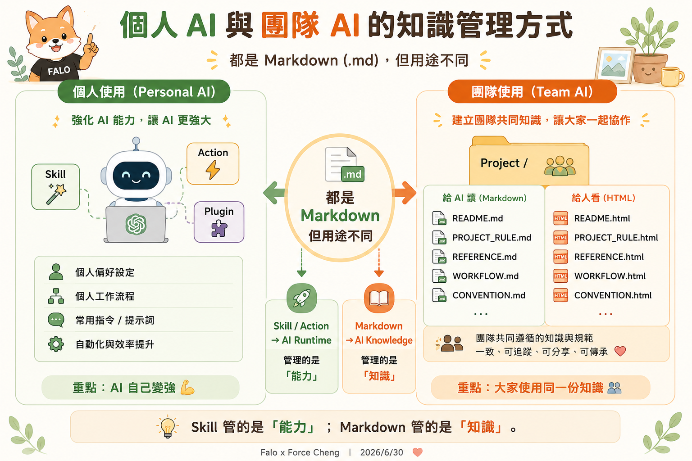
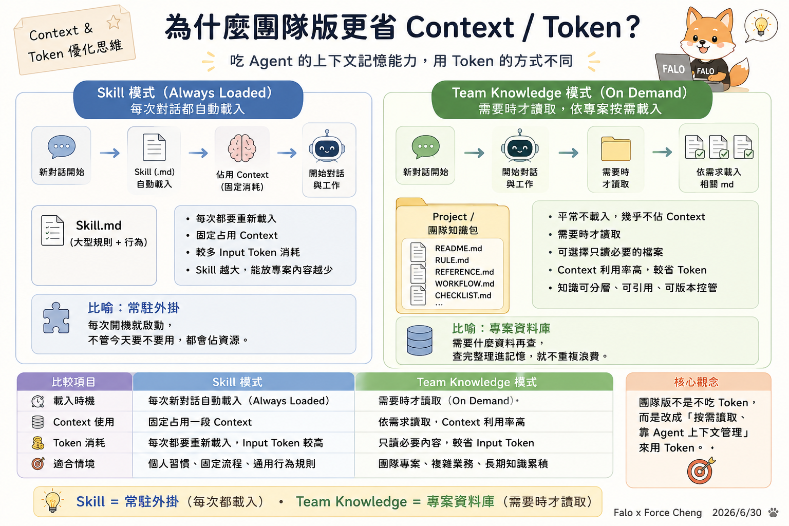

# 主題一：前三堂課程交流與補充

> [!NOTE] 📂 **前三堂課程簡報 PDF 下載與存取說明** • **Class 1 課程簡報**：<a href="javascript:void(0);" onclick="verifyPdfPassword('https://drive.google.com/file/d/1lcTQQ4ceWf8-I-qxifTIbkTq8gwW0Pp7/view')" style="color: var(--accent); font-weight: bold; text-decoration: underline;">🌐 Google Drive 下載連結</a> • **Class 2 課程簡報**：<a href="javascript:void(0);" onclick="verifyPdfPassword('https://drive.google.com/file/d/1FV_SEjwf68vgd_CH28ScJSjz1FiwxxTw/view')" style="color: var(--accent); font-weight: bold; text-decoration: underline;">🌐 Google Drive 下載連結</a> • **Class 3 課程簡報**：<a href="javascript:void(0);" onclick="verifyPdfPassword('https://drive.google.com/file/d/1XDK6z2988pxJ0mIHCvgQmjFEHVCc2UeM/view?usp=sharing')" style="color: var(--accent); font-weight: bold; text-decoration: underline;">🌐 Google Drive 下載連結</a> • 🔑 **PDF 檔案密碼提示**：公司英文縮寫。

本單元旨在對前三週的學習重點進行深度沉澱與補充，並以 AI App Studio 的核心原則為基礎，規範專案開發、雙軌文件、AI 理解與指標評估。

---

## 📌 主題一：常見提醒與交付規範 (台灣時間 UTC+8) {#guidelines}

> [!IMPORTANT]
> 本課程與專案之所有宣告、作業交付截止日期等時間，皆**統一宣告並以台灣時間 (UTC+8) 為唯一準則**。

* **時間統一標準**：所有宣告、作業交付截止日期等時間，皆以台灣時間 (UTC+8) 為唯一準則。
* **雙軌標準規範 (md + html)**：所有提問集、作業及大綱，必須同時提交 **Markdown (.md)** 檔與 **HTML (.html)** 網頁檔，落實人機雙軌並行。
  * **Markdown 檔**：供 AI / LLM 結構理解，利於上下文控制與代碼生成。
  * **HTML 網頁檔**：供人類清晰閱讀，方便直觀展示與簡報。
* **壓縮包命名習慣 (ZIP 檔案)**：凡提交程式碼或專案資源壓縮包時，請遵循 **「[時間戳記]_[重要更新事項].zip」** 命名規範（例如：`20260630_class04_project.zip`）。

---

## 📌 主題二：雙軌文件策略 (md + html) {#double-track}

在 AI-Native 開發模式下，文件兼顧人機雙軌並行，達成「一份內容，AI 讀得懂，人也看得懂」：

* **Markdown (.md)**：語意結構清晰，便於 LLM 語意理解，利於 RAG 檢索，方便代碼生成與上下文控制。
* **HTML (.html)**：視覺樣式豐富，具備互動效果，方便團隊成員閱讀，以及管理層與客戶直觀理解。

### 🚀 案例研究：Superpowers 的 HTML 本地化與雙軌優勢
在 AI-Native 開發中，我們以知名 AI 技能庫 [Superpowers](https://github.com/obra/superpowers) 為例，展示同一個技能檔在不同表達載體上的雙軌輸出與優勢。詳細的「HTML 本地化優勢與功能展示」已收錄於我們的 [FALO 雙軌教材介紹網頁](https://falo-taiwan.github.io/superpowers/) 中。

本教材包中提供以下三種檔案版本，供您對照學習其結構與轉譯效果：
* 🌐 <a href="superpowers_skill_official.md" target="_blank">官方原始 Markdown 技能檔 (superpowers_skill_official.md)</a>：最純粹的官方英文邏輯，適合配置給 AI 工具。
* 📝 <a href="superpowers_skill.md" target="_blank">FALO 專案 Markdown 技能檔 (superpowers_skill.md)</a>：本機英文代碼版，嵌入了 CSS/HTML 互動組件。
* 📖 [FALO HTML 雙語互動好讀版](superpowers_skill.html)：透過編譯注入中文導讀、互動平台 Tabs 與視覺化 Timeline 的最強學習版本。

---

## 📌 主題三：AI-Native 思維 {#ai-native}

* **AI-Native 開發工作流**：
  $$\text{人類（提出需求）} \longrightarrow \text{HTML（人類閱讀理解內容）} \longrightarrow \text{AI（AI 理解語意處理）} \longrightarrow \text{Code（代碼自動生成）} \longrightarrow \text{AI Agent（執行任務）}$$
* **核心理念**：同一份知識與需求描述，既能讓人類清晰閱讀，又能讓 AI 自動理解語意，進而產生程式碼或執行行動，實現 AI-Native 的自動化開發流程。

---

## 📌 主題四：專案評估 (診斷核心指標) {#project-evaluation}

在啟動 AI 專案或導入工具前，必須通過以下四項核心指標的 GO / NO GO 診斷評估：

1. ❤️ **痛點真實性**：該業務流程是否為每日重複、耗費高昂人工工時的痛點？
2. 🧠 **AI 必要性**：是否必須使用 LLM 進行語意理解與複雜決策？還是傳統的 Rule-based (規則/公式) 或 Regex (正規表示式) 就能解決？
3. 📁 **資料可得性**：專案是否有足夠且合規的真實樣本數據，以供 AI 學習、對照與測試？
4. 💰 **落地經濟性**：Token 的消耗、API 呼叫與運行維護成本，在商業上是否可控且具備投資報酬率？

綜合評估後，確認專案是否值得投入（GO / NO GO）。

---

## 📌 主題五：怎麼善用 Agent Skills {#agent-skills}

善用 AI 技能 (Skills) 與團隊知識管理是提升人機協作效率的關鍵，以下透過三張核心圖表進行深度解析：

### 1. 能力 (Skills) 與知識 (Knowledge) 的定位差異

* **個人使用 (Personal AI) ➔ 管理「能力 (Skill)」**
  透過 `Skill.md` 定義 AI 助理的行為準則與工具調用流程，注入 AI 執行階段 (AI Runtime)，讓 **AI 自己變強**。
* **團隊使用 (Team AI) ➔ 管理「知識 (Markdown + HTML)」**
  建立專案共享文件目錄（如 `README`、`PROJECT_RULE`、`WORKFLOW`），落實雙軌並行，讓 **大家使用同一份知識與規範**。

---

### 2. Context 與 Token 的資源優化策略

* **Skill 模式（常駐外掛 🔌）**：每次啟動對話時，AI 都會自動載入該 Skill 的 Markdown 全文（Always Loaded）。雖然反應即時，但會固定且持續佔用 Context 空間，並消耗重複的 Input Token。
* **Team Knowledge 模式（專案資料庫 🗄️）**：平時檔案安靜存放在目錄中，AI 僅在需要時才經由搜尋或讀取工具載入特定檔案（On Demand）。不佔用啟動時的 Context，使資源利用率最大化。

---

### 3. 哪些 Skill 值得放在「每次都自動載入」？

* **原則**：放「每次對話都應該遵守或常用的能力」。
* **公約型 Skill (Global Convention)**：每次都要遵守的通用規則與行為準則。
  * *包含*：語言與格式公約、資訊安全公約、程式開發公約、時間與單位公約、工作流程公約、協作與溝通公約、檔案與命名公約、品質與驗收公約。
* **技能型 Skill (Capability / Tool)**：AI 能夠立即執行的常用能力與工具。
  * *包含*：數據分析、資料處理、報表產出、研究與調查、程式開發、文件撰寫、翻譯與摘要、創意與策略。
* **不建議放在 Skill（改放團隊知識包）**：專案背景 (`ai_app_readme.md`)、業務流程 (`WORKFLOW.md`)、規格文件 (`REFERENCE.md`)、驗收標準 (`CHECKLIST.md`)、大量真實案例數據。
* **AI Context 載入順序**：
  $$\text{1. Skill（每次自動載入）} \longrightarrow \text{2. 專案知識包（按需載入）} \longrightarrow \text{3. 當前對話任務（Working Context）}$$

> **好的 Skill 設計 = 固定公約 + 常用能力，讓 AI 每次對話都在最佳狀態！**
