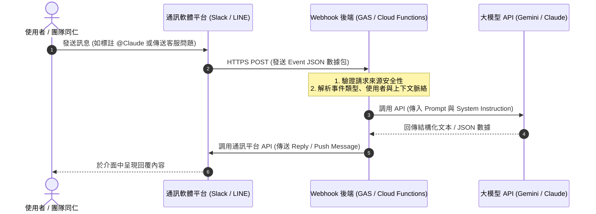

# 主題五：Agent 工具應用交流

本主題探討主流 AI Agent 開發工具的橫向對比、使用心法，以及如何將軟體工程思維融入 AI 專案規劃中。

---

## 🧠 主軸 2：AI 專案規劃與實作思維：從痛點走向 AI App Store
本週將進行關鍵思維躍升：從 **AI 工具認識 ➔ AI 工作流 ➔ AI 能力建立**，正式轉向 **AI 專案思維 ➔ AI App 思維 ➔ AI 產品思維**。
我們將透過 **AI App Workshop**，引導同仁將日常工作的「痛點」轉化為「AI App 需求池」，最終匯聚成銀河 ERP × FALO AI App Store 的核心資產。

### 產品思維三大支柱
1. **痛點價值定位**：不為 AI 而 AI，必須精準解決高頻、耗時的業務痛點。
2. **零運維與低成本**：設計高性價比的架構（如 Static Web + Serverless），確保企業運行成本最小化。
3. **結構化交付**：將大模型的靈性輸出，轉化為 100% 穩定、符合 ERP 格式要求的 JSON 數據。

---

## 🛠️ 主軸 4：AI 專案所需技能與解析
開發企業級 AI App 不僅僅是寫 Prompt，更需要一套完整的「AI-Native 軟體工程技術棧」：
* **前端與交互**：熟練掌握 HTML5/CSS3 及輕量 Javascript，打造直觀、流暢的用戶界面（如 Swiper 刷題卡片）。
* **API 整合與控制**：精準調用大模型 API（如 Gemini Vision），優化 Prompt 與參數（Temperature, System Instruction）以獲得穩定輸出。
* **規則與清洗引擎 (ETL)**：運用正規表示式（Regex）、狀態機及資料清洗管道，校對並修復大模型輸出的噪聲數據。
* **安全性與防禦**：設計離線快取、CORS 探針、API 金鑰安全控管等防禦性代碼，確保系統在複雜內網環境下穩定運行。

---

## 📊 AI 開發工具對比分析表

| 工具名稱 | 核心定位 | 優勢特色 | 實戰技巧/限制 |
| :--- | :--- | :--- | :--- |
| **Antigravity (AI 程式助理)** | AI Agent 開發與代碼生成 | 專為本機/雲端 Pair Programming 設計，高效率產出高保真代碼 | 善用 Markdown 做為專案記憶與上下文控制，引導 AI 遵循標準 |
| **n8n / GAS** | 企業工作流自動化與 ERP 串接 | 視覺化 Workflow 與 Google 服務無縫串接，適合無程式碼/低程式碼開發 | 可作為 Event-Rule-Action 落地執行的白箱管道，易於快速驗證 |

---

## 💬 企業通訊軟體 Agent 實務：Slack 與 LINE 整合應用

在企業數位轉型的過程中，將 AI Agent 落地於通訊軟體是提升組織協作與客戶服務效率的最直接途徑。本章節將結合 Anthropic 最新推出的 **Claude Tag (Slack 整合)** 與 **LINE Bot (聊天機器人)**，剖析企業級 AI Agent 在不同通訊端點上的應用思維與技術架構。

| 📰 實務新聞報導 | 💬 官方實戰專區 |
| :--- | :--- |
| [Anthropic 推出 Claude Tag 讓 AI 進入 Slack 成為團隊成員 ➔](https://www.techbang.com/posts/130504-anthropic-claude-tag-slack-integration) | [LINE Bot 聊天機器人整合實務與 AI 自動對答技巧 ➔](https://falo-taiwan.github.io/ai-line-help/) |

### 1. Claude Tag (Slack 整合) 實務收納
Anthropic 於 2026 年 6 月推出了 **Claude Tag** 功能（搭配 Opus 4.8 運作）。這項功能的推出標誌著 AI 輔助工作從「個人對話」正式演進為「團隊協作」。

其核心技術與應用特點如下：
* **群組協作型 Agent (Collaborative Agent)**：以往的 AI 工具多為一對一的個人對話視窗，容易形成資訊孤島。Claude Tag 允許企業將 Claude 加入指定的 Slack 頻道中。頻道內的成員只要標註 `@Claude`，就能將任務委派給它。所有成員都能看見它的執行進度，並能接續前一位同事的討論繼續推進工作，如同頻道中多了一位 AI 同事。
* **非同步與自主執行 (Asynchronous & Autonomous Execution)**：使用者在頻道中指派複雜任務後，即可先處理其他工作。Claude 會自行拆解任務、按階段執行，並在完成後於 Slack 討論串（Thread）中回覆結果。它甚至能為自己規劃數天內的主動任務。
* **主動監聽模式 (Ambient Mode)**：當開啟主動模式時，Claude 可主動提醒使用者需要注意的資訊，例如追蹤頻道中停滯、尚未解決的討論串或任務，主動提供協助。
* **頻道脈絡繼承與嚴格權限隔離**：Claude 會隨著時間累積它所在頻道的討論背景、專案資訊與討論風格，讓使用者不必每次重新解釋需求。同時，管理員能針對不同頻道設定不同的工具、資料（如 Codebase 或銷售數據）與 Token 花費上限。為銷售團隊設定的 Claude 記憶不會傳遞給工程團隊，確保企業資料的安全邊界。

### 2. Slack (Claude Tag) 與 LINE Bot 橫向技術對比
企業對內協作與對外服務的需求不同，在通訊管道的選擇與 Agent 設計上亦有顯著差異。以下為兩者的橫向對比：

| 比較維度 | Slack @Claude (企業內部協作型) | LINE Bot (企業外部/服務型) |
| :--- | :--- | :--- |
| **主要應用定位** | 企業內部團隊協作、高密度非同步專案推進、代碼與工單處理 | 針對外部客戶的客服諮詢、輕量個人提醒、行銷與訂單自動化 |
| **交互模式** | 多對一（群組頻道公開協作，利用 Thread 討論串追蹤脈絡） | 一對一隱私對答（1-on-1）、群組被動響應或指令觸發 |
| **觸發與互動機制** | `@Claude` 標記觸發、`ambient` 主動監聽、Thread 上下文繼承 | 使用者傳送訊息、圖文選單 (Rich Menu) 點擊、LIFF 網頁交互 |
| **主動推送能力** | 於頻道中發送 Thread 回覆、主動提示相關任務進度 | 透過 Push Message API 主動向特定用戶推送客製化訊息 |
| **安全隔離機制** | 企業組織級權限控管、頻道與工具存取範圍隔離（資料不跨頻道） | Webhook Signature (X-Line-Signature) 驗證、Channel Access Token 管理 |

### 3. 底層共通性解構：事件驅動 Webhook 架構
雖然 Slack 與 LINE 的前端呈現與使用者體驗不同，但兩者在技術實現上完全共通，皆採用 **事件驅動架構 (Event-driven Architecture)**。

當使用者在通訊軟體上發送訊息或觸發事件時，平台的伺服器會將該事件包裝成 JSON 數據，透過 HTTP POST 發送到我們預先設定好的 **Webhook URL**（例如部署在 GAS、AWS Lambda 或 Google Cloud Functions 的後端服務）。後端服務解析事件後，調用大模型 API（如 Gemini API）生成回覆，再調用通訊軟體的 API 將訊息回傳給使用者。

其共通的技術流程如下圖所示：

開發企業級通訊軟體 Agent 時，軟體工程思維的展現主要在於**步驟 3 的後端處理**。我們必須在後端建立完善的快取機制以節省 Token 成本，設計防禦性代碼以應對平台超時限制（例如 LINE Webhook 要求在數秒內響應，複雜 LLM 任務需採用非同步處理），並透過 ETL 模組清洗大模型輸出的 JSON 數據，確保其符合企業系統的格式要求。

---

## 🔗 其他參考資源
* [IPAS AIAP 課程網站](https://forceai0001-commits.github.io/ipas-aiap-2026/)：提供歷屆考試資源與 AI 技術學習指引，加深學術與實戰結合。
* [LINE Bot 專業開發專區](https://falo-taiwan.github.io/ai-line-help/)：專家級 LINE 聊天機器人整合實務與 AI 自動對答技巧，提供多元管道輸出示範。
