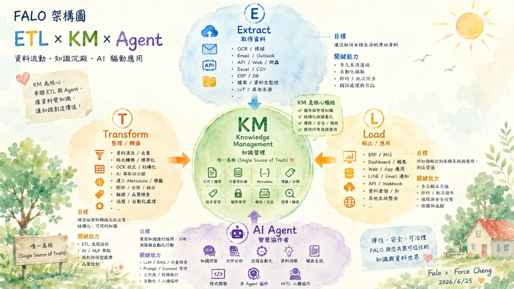

# 主題三：ETL 實務案例分享

本主題分享多個高保真（High-Fidelity）的 ETL 與 OCR 整合實戰案例，引導同仁理解如何進行結構化資料轉置與自動化處理。

## 學習目標
- 掌握 OCR 影像識別與人機協作（HITL）的整合架構。
- 學習如何設計本地端自包含的刷題與資料處理工具。
- 實作電子憑證自動處理與多媒體資料萃取流程。

## 核心內容與資源
- [🌐 iPAS 智慧刷題模擬器 (線上 falo 網址)](https://falo-taiwan.github.io/class/a01/class4/practice-swiper.html)
- [🚀 核心實戰案例展示](index.html#cases-section)
- [📂 實戰專案與手冊](index.html#handbooks-section)
