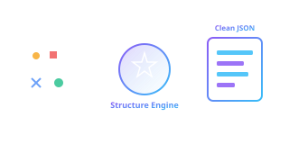
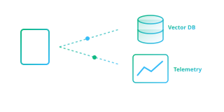
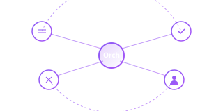
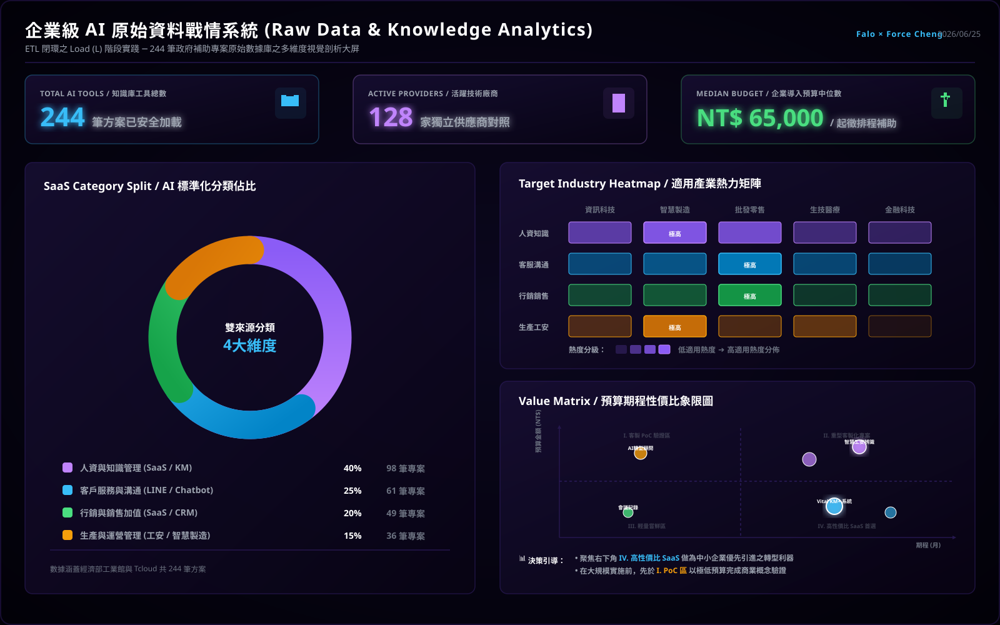
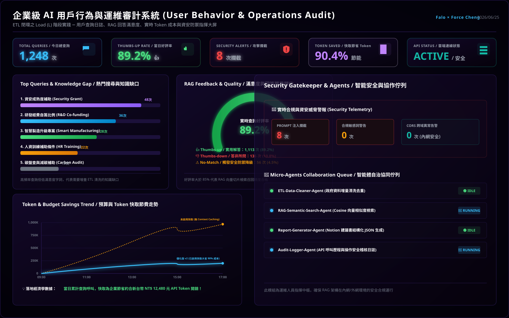
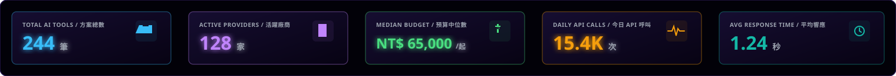
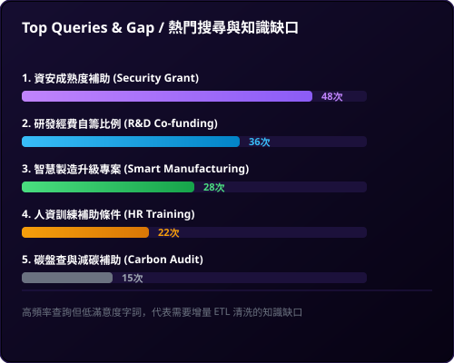
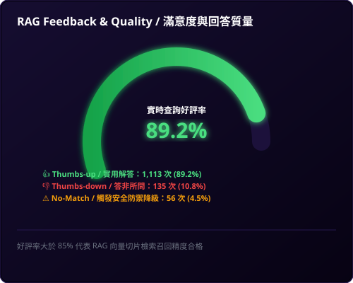

# 主題三：ETL 實務案例分享

本主題分享多個高保真（High-Fidelity）的 ETL 與 OCR 整合實戰案例，引導同仁理解如何進行結構化資料轉置與自動化處理。

## 🛠️ FORCE × Agent 核心四大階段深度解析 (Core Phases)

以下針對 FORCE 智慧協作平台之 **E、T、L、Agent** 四大階段進行深度技術解析，引導學員掌握數據從「異質採集」到「自主決策」的完整演進路徑。

---

### 📥 E (Extract) - 取得資料 {#etl-e}

這是數據管線（Data Pipeline）的起點，專注於從多元、異質的源頭中採集原始資訊。在企業級應用中，數據源通常包含：
- **結構化數據**：ERP 資料庫、關聯式資料庫（SQL）交易紀錄、標準 FORCE API 接口。
- **半結構化數據**：Email 通訊、CSV 報表、JSON 數據流。
- **非結構化數據**：紙本憑證掃描件（PDF/圖片）、會議錄音（語音）、教學影片（影格）。

在 AI 時代，E 階段更被賦予了「多模態感知起點」的使命。透過電腦視覺與 OCR Agent，系統能像人類的眼睛一樣，主動辨識實體世界與非結構化文件中的視覺元素，將其轉化為可供處理的原始文本流（Raw Stream），為後續的 FORCE 知識轉置提供源源不絕的素材。

> [!NOTE]
> 🔗 **相關展示與範例網站**：*(後續將在此插入具體範例網站與相關連結)*

---

### ⚡ T (Transform) - 整理 / 轉換 {#etl-t}

這是整條數據管線的「核心靈魂」，負責將前階段採集到的無序 Raw 數據，進行極致的降噪、清洗、校正與結構化封裝。核心處理邏輯包括：
1. **資料清洗與去重**：排除重複行、去除頁首頁尾、過濾空白字符與多餘雜訊。
2. **OCR 校正與補件**：針對圖片辨識出的斷字、錯字進行語意校正，並補齊遺漏欄位。
3. **AI 萃取與分類**：調用大語言模型（LLM）的推理能力，從段落中精確辨識並分類出實體（如金額、日期、品項、統編）。
4. **建立 Metadata / 標籤**：自動生成檔案的版本、分類標籤、權限屬性，並將資料轉置為標準的結構化 JSON 格式。

經過 T 階段的處理，原本雜亂無章的非結構化數據將轉化為「高價值、高清晰度、機器與 AI 皆可讀」的黃金數據（Clean JSON），並生成對應的向量嵌入（Embedding），為中央 FORCE 知識庫做好準備。

> [!NOTE]
> 🔗 **相關展示與範例網站**：*(後續將在此插入具體範例網站與相關連結)*

---

### 📤 L (Load) - 輸出 / 應用 {#etl-l}

這是管線價值落地的「最後一公里」，負責將清洗乾淨且結構化後的黃金數據，精準加載至目標系統中，進而轉化為企業的決策價值。主要的載入目標與應用場景 include：
- **知識沉澱（Vector DB）**：加載至向量資料庫（如 Milvus、Pinecone 或本地向量索引），作為 RAG（檢索增強生成）系統的核心知識源。
- **業務整合（ERP / SQL）**：與 FORCE 平台或現有的 ERP、CRM 或 MIS 系統對接，自動完成單據入帳、主數據更新。
- **運維監控（Dashboard）**：加載至戰情中心，實時呈現數據流狀態、Token 流量花費、以及 API 性能遙測數據（Telemetry）。
- **主動通知（Notifications）**：加載完成後自動觸發下游通知，如 LINE 訊息推播、Email 自動派送或 Webhook 觸發。

L 階段將結構化知識加載到正確的位置，使靜態的數據重新「活」了起來，成為驅動企業運營的即戰力。

> [!NOTE]
> 🔗 **相關展示與範例網站**：*(後續將在此插入具體範例網站與相關連結)*

---

### 🤖 Agent (AI Agent) - 智慧協作 {#etl-agent}

這是整條 ETL 管線的「大腦指揮官」，對應 FORCE 架縱最底層的 **AI Agent 智慧協作平台**。它改變了傳統自動化程式的僵化思維，引入了具備推理與規劃能力的自治 Agent 佇列：
- **Workflow Agent**：主動規劃多步驟工作流，串聯不同的微服務。
- **OCR / ETL Agent**：自主判斷最適合的辨識引擎，並在辨識失敗時進行自我反思與重試。
- **Audit Agent**：全量審查入帳數據，主動識別異常交易、重複報支或合規漏洞。
- **人機協作（HITL, Human-in-the-Loop）**：當系統遇到低置信度數據或高風險操作時，Agent 會主動暫停並將任務派送給人類主管進行審批，兼顧效率與安全。

AI Agent 貫穿了 E-T-L 的全生命週期，讓整個數據管線具備了自我優化、主動防禦與自主決策的智慧能力。

> [!NOTE]
> 🔗 **相關展示與範例網站**：*(後續將在此插入具體範例網站與相關連結)*

---

## 🚀 核心實戰案例展示 (Featured Case Studies)

以下為 Class 04 重點示範專案，著重於將電腦視覺、OCR 辨識與企業工作流/智慧稽核整合運作的實際落地設計。

### 案例一：Video to PPT 智慧簡報影格萃取與知識庫
* **專案精神**：捕捉專家經驗 ➔ 建立企業知識管理 (KM) 資料庫，且執行時完全不耗費任何 AI API Token（零運行成本）。
* **技術整合特點**：
  * **圖像變化偵測**：OpenCV 平均絕對誤差 (MAE) 進行快速變動判定。
  * **雜湊去重與過濾**：64位元差值雜湊 (dHash) 漢明距離去重，輔以 Laplacian 邊緣變異數進行模糊與黑底畫面過濾。
  * **OCR 與智慧搜尋 (RAG)**：擷取圖片後，串接 OCR (PaddleOCR/EasyOCR) 提取文字並進行向量嵌入 (Embedding)，讓簡報投影片內容可直接透過 LLM 進行語意問答與查詢。
* **示範影片**：課堂播放最強完整版功能展示影片 `demo.mp4`。
* **學員基礎代碼**：[📥 下載學生基礎版代碼 (video_to_ppt_basic.zip)](video_to_ppt_basic.zip) *(內含 Python 偵測腳本與 README 說明，供課堂練習使用)*。

### 案例二：AAA-Evidence Hub 企業電子憑證自動化處理平台
* **專案精神**：針對中小企業與一人資訊部門 (OPC) 設計的 PoC，完整打通「憑證收集 ➔ 辨識 ➔ 轉換 ➔ 簽核 ➔ 模擬 ERP 入帳 ➔ 自動稽核」之閉環。
* **技術整合流程**：
  * **1. 辨識層 (OCR)**：整合 Layout-free LLM Vision API / Google OCR / PaddleOCR 提取非結構化憑證欄位。
  * **2. 轉換層 (ETL)**：將憑證資料清洗並標準化為 Expense Record 格式。
  * **3. 工作流 (Workflow)**：以狀態機驅動自動送審、會計覆核與模擬過帳流程。
  * **4. 智慧稽核 (AI Audit)**：比對歷史資料進行重複核銷防弊、設定金額上限警示、以及透過語意理解驗證「週末公務乘車事由」之合規性。
* **互動展示**：[🌐 開啟線上互動展示頁 (ticket-demo)](https://force-taiwan.github.io/ticket-demo/)

### 案例三：iPAS 智慧刷題模擬器 (OCR + ETL 實戰)
* **專案精神**：結合大模型視覺 (Gemini Vision API) 與高精度 OCR 技術，將紙本/圖片題庫進行即時結構化轉換、清洗與自動答題之完整 ETL 實踐。
* **技術整合特點**：
  * **1. 影像擷取與 OCR**：通過前端模擬器擷取題目圖片，調用 Vision API 進行精準文字與排版特點提取。
  * **2. 資料清洗 (ETL)**：利用 Regex 與規則引擎對 OCR 斷字、多餘空格進行極致降噪與欄位校對，轉化為標準 JSON 格式。
  * **3. 模擬器交互 (Swiper)**：結合 Swiper.js 打造流暢的滑動刷題體驗，內建即時 Token 消耗與台幣花費 Telemetry 面板，落實企業級 AI 成本控制意識。
* **雙通道體驗入口**：
  * [🌐 開啟 iPAS 智慧刷題模擬器 (線上 force 網址)](https://force-taiwan.github.io/class/a01/class4/practice-swiper.html) *(將於新視窗中開啟線上版模擬器)*

## 🚀 ETL 之 L (Load) 實踐：企業級 AI 雙軌戰情中心 (War Room) 與元件解構

在企業數據管線（Data Pipeline）的 ETL 閉環中，**Load (L) 階段**不僅僅是將清洗好的數據載入向量資料庫，更包含「如何將高價值的結構化數據呈現給決策者（Data Analytics）」以及「如何實時監控系統的健康度、安全防禦與用戶行為日誌（Operations Telemetry）」。

為了讓學員深刻理解下一代 ERP 生態圈的 AI 運維架構，我們將本課程的政府補助案 RAG 專案進行了延伸開發，設計了一套高質感的深色科技風格**「企業級 AI 雙軌戰情中心」**。這套系統分為兩個獨立的主大屏，分別對應資料剖析與用戶行為審計。

---

### 🖥️ 雙軌戰情中心大屏全景藍圖

學員可在宏觀大屏中體驗「密密麻麻」的高密度指揮中心布局。大屏整合了全局指標，有需要時可「點進去細看」下方物理拆解的各個元件。

#### 1. 版本 A：原始資料戰情系統大屏 (Raw Data & Knowledge Analytics)
此系統專注於**靜態原始資料的加載與多維度剖析**。呈現 244 筆政府補助案的整體結構：

#### 2. 版本 B：使用者行為與運維審計戰情系統大屏 (User Behavior & Operations Audit)
此系統專注於**動態用戶行為、RAG 回答質量、實時 Token 成本與資安防禦監控**：

---

### 📂 雙軌戰情系統八大核心元件物理拆解與深度解構

為了讓學員理解在不同商業與工程場景下，如何選擇並設計最適的圖表類型，我們將上述兩大系統拆解為 **八大核心儀表板元件**，逐一進行視覺展示與深度技術解構：

#### 📊 原始資料戰情系統 (版本 A) 元件解構

##### 元件 A1：大盤核心 KPI 指標面板 (Top Cards)

*   **圖表類型**：**數值指標卡 (Metric Cards)** ＋ **趨勢微線圖 (Sparklines)**。
*   **商業洞察**：即時呈現「方案總數 244 筆」、「活躍廠商 128 家」、「導入預算中位數 NT$ 65,000」等核心大盤數據，並在下方搭配微幅波動的綠色微線圖，表徵數據的穩定載入狀態。這組指標能讓決策者秒級掌握系統負載與數據規模。
*   **技術實現**：在前端異步加載靜態 `unified_ai_tools_db.json` 資料庫（壓縮後僅約 150KB），在內存中通過高效的 JavaScript 數組處理（如 `Set`、`reduce`）動態計算指標，保證 0 延遲加載。

##### 元件 A2：AI 標準化分類佔比圓環圖 (Donut Chart)

*   **圖表類型**：**環狀比例圖 (Donut Chart)** ＋ **結構百分比清單 (Legend Grid)**。
*   **商業洞察**：揭示了補助案在四大 SaaS 領域的分佈。「人資與知識管理 (40%)」佔比最高，是目前政府補助的主力方向；其次為「客戶服務與溝通 (25%)」、「行銷與銷售加值 (20%)」及「生產與運營管理 (15%)」。這能引導企業將資源優先投入最易獲得政府補助的領域。
*   **技術實現**：採用 SVG 原生的 `stroke-dasharray` 與 `stroke-dashoffset` 動態圓環比例繪製，結合 CSS `transition` 提供極致流暢的加載動畫，完全避免了第三方圖表庫（如 Chart.js）帶來的打包體積膨脹。

##### 元件 A3：適用產業熱力矩陣 (Heatmap)

*   **圖表類型**：**二維熱力矩陣 (2D Heatmap Matrix)** ＋ **熱度分級標註 (Density Indicators)**。
*   **商業洞察**：以熱力漸層色彩標註不同 AI 分類在「資訊、製造、零售、醫療、金融」五大產業的適用度。例如「製造業」在「人資知識」與「生產工安」中熱度極高，能幫助企業進行精準的 SaaS 定位。
*   **技術實現**：設計成全局過濾器。當使用者在前端點選矩陣中的特定格子時，會觸發雙向聯動，整個戰情中心的數據（包括圓環圖與象限圖）將立即根據該產業過濾並重新渲染。

##### 元件 A4：預算期程性價比象限散佈圖 (Quadrant Scatter Plot)

*   **圖表類型**：**四象限 Bubble 散佈圖 (Quadrant Bubble Plot)** ＋ **黃金分割十字臨界線 (Threshold Crosshair)**。
*   **商業洞察**：以橫軸「期程 (月)」與縱軸「預算金額」劃分出四大決策象限，協助企業進行精準決策：
    *   **I. 客製 PoC 服務**：高預算、短週期，適合前期概念驗證。
    *   **II. 重型專案系統**：高預算、長週期，適用大型核心系統導入。
    *   **III. 輕量嘗鮮區**：低預算、短週期，適合小範圍敏捷試錯。
    *   **IV. 高性價比 SaaS**：低預算、長週期，是企業轉型、低成本高收益的首選（如 Vital KM+）。
*   **技術實現**：利用 SVG 散佈點（Scatter Plot）定位，氣泡大小與方案熱度掛鉤。透過黃金中位數（6個月期程與 6.5 萬元預算）作為十字交叉線，為企業自動篩選出最優轉型路徑。

---

#### 👤 使用者行為與運維審計系統 (版本 B) 元件解構

##### 元件 B1：熱門搜尋詞與知識缺口橫條圖 (Horizontal Bar Chart)

*   **圖表類型**：**水平長條圖 (Horizontal Bar Chart)** ＋ **排名標籤 (Rank Badges)**。
*   **商業洞察**：列出 Top 5 查詢頻率最高的詞彙（例如「資安成熟度補助」、「自籌經費比例」等）。這代表企業內最迫切的「知識缺口 (Knowledge Gap)」，如果某些高頻問題的查詢好評率很低，則能直接指導企業下一次 ETL 增量清洗與載入的方向，形成「數據閉環」。
*   **技術實現**：在前端記錄用戶每次的 Search Query，非同步寫入運維審計日誌。數據加載模組定期以 MapReduce 方式在前端進行頻次聚合，並利用 SVG 的 `<rect>` 元素渲染出高質感的漸層水平長條。

##### 元件 B2：RAG 回答滿意度與質量圓弧儀表 (Radial Gauge Chart)

*   **圖表類型**：**半放射狀圓弧儀表 (Radial Gauge)** ＋ **好評率 KPI (Feedback KPI)**。
*   **商業洞察**：呈現用戶按讚/按踩的好評率（89.2%），並展示 LLM 未匹配率 (4.5%)，讓運維人員一眼看出 AI 答得好不好。這直接反映了知識庫切片與 Embedding 檢索的精準度。
*   **技術實現**：前端 UI 提供 thumbs-up/down 的一鍵反饋按鈕。統計引擎異步統計好評率，並動態調用 SVG 的 `stroke-dashoffset` 將好評率即時轉化為綠色發光半圓弧進度條。

##### 元件 B3：Token 流量與快取節費折線走勢圖 (Real-time Line Chart)

*   **圖表類型**：**雙折線區域圖 (Dual-line Area Chart)** ＋ **漸層填充 (Gradient Fill Area)**。
*   **商業洞察**：一條陡峭上升的橙色虛線（未啟用快取的線性花費）對比一條極度平緩的藍色實線（啟用 Context Caching 後的快取花費），以極具衝擊力的折線圖直觀證明「快取大省 90% 成本」的經濟學威力，向決策同仁展示實實在在的「企業 AI 降本增效」。
*   **技術實現**：前端對話引擎在每次發起 API Request 前，會讀取並記錄本地 API 返還 of `usageMetadata`，並在前端繪製出一條包含 `linearGradient` 漸層填充的雙折線區域圖。

##### 元件 B4：資安 Gatekeeper 與多 Agent 自治佇列 (Security Alarm & Agent Queue)

*   **圖表類型**：**告警狀態面板 (Security Alarm Panels)** ＋ **流水線狀態佇列 (Agent Pipeline Queue)**。
*   **商業洞察**：上方以紅色警報燈監控當日 Prompt 注入攻擊攔截次數（8次）與違規敏感詞查詢，保障系統的生命線；下方監控 ETL-Agent、RAG-Agent、Report-Agent 等非同步協作佇列的執行狀態（ACTIVE/IDLE），讓運維人員精準掌握後台微服務的負載。
*   **技術實現**：資安防護模組（Gatekeeper）攔截惡意輸入並即時寫入告警計數器；微服務協調器（Orchestrator）在非同步工作流啟動與休眠時，通過 Webhook 將狀態即時推送到戰情中心佇列面板。

---

---

## 📂 實戰專案與手冊
本主題提供豐富的實戰手冊，引導您一步步動手實作上述的案例：
* [🔍 痛點與需求驗證手冊](discovery_validation_playbook.html)：學習如何掃描並定位真實業務痛點。
* [🚀 MVP & PoC 規劃指南](mvp_poc_guide.html)：掌握最簡可行產品的架構設計與交付方法。
* [📋 50+ AI App 創意 Backlog](backlog_template.html)：參考銀河 ERP 實際梳理出的需求池，加速靈感轉換。
