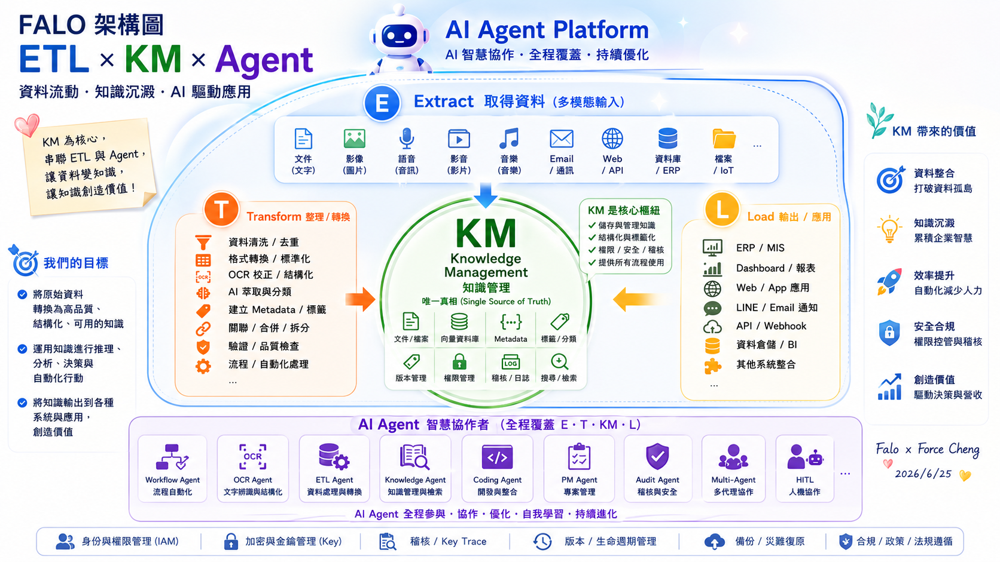

# 主題三：ETL 實務案例分享

本主題分享多個高保真（High-Fidelity）的 ETL 與 OCR 整合實戰案例，引導同仁理解如何進行結構化資料轉置與自動化處理。

## 🛠️ FORCE × ETL 核心階段深度解析 (Core Phases)

以下針對 FORCE 智慧協作平台之 **E、T、L** 三大核心階段進行深度技術解析，引導學員掌握數據從「異質採集」到「加載應用」的完整演進路徑。

---

### 📥 E (Extract) - 取得資料 {#etl-e}

這是數據管線（Data Pipeline）的起點，專注於從多元、異質的源頭中採集原始資訊。在企業級應用中，數據源通常包含結構化資料（ERP、資料庫）、半結構化資料（Email、CSV、JSON）與非結構化資料（紙本憑證、會議錄音、教學影片等）。

---

### ⚡ T (Transform) - 整理 / 轉換 {#etl-t}

這是整條數據管線的「核心靈魂」，負責將前階段採集到的無序原始數據，進行降噪、清洗、校正、AI 語意萃取與結構化封裝（例如轉換為標準的 Clean JSON 格式），為後續的知識庫檢索與決策應用做好準備。

---

### 📤 L (Load) - 輸出 / 應用 {#etl-l}

這是管線價值落地的「最後一公里」，負責將清洗乾淨且結構化後的黃金數據，精準加載至目標系統中（如向量資料庫、ERP 系統、戰情監控面板或自動通知 Webhook），進而轉化為企業的實質決策與業務價值。

---

## 🚀 核心實戰案例展示 (Featured Case Studies) {#featured-cases}

以下為 Class 04 重點示範專案，著重於將電腦視覺、OCR 辨識與企業工作流/智慧稽核整合運作的實際落地設計。

### 案例一：FALO Prompt Manager ─ 企業級提示詞資產管理平台
* **專案精神**：針對企業與 AI 教育訓練設計的本機優先 PWA 提示詞資產管理平台，整合變數動態替換、多模型裝盤教學（Model-Dish）與工作流 Prompt 卡片，解決企業內部提示詞資產混亂、難以複用與培訓銜接的痛點。
* **技術對比與特點**：
  * **動態變數與工作流卡片**：支援雙欄「編輯對照工作台」與即時變數渲染預覽，能將複雜的 AI 任務拆解為時間序列的「工作流 Prompt 卡片（Workflow Strip）」，指導同仁依序執行；支援離線 PWA、語音輸入與高精度 OCR 輔助輸入。
  * **多主題教學與 JSON Connect**：專門針對大型課堂設計「教學大字體主題」與「模型裝盤」示範，支援拖拽式 CSV/JSON 模板批量導入與導出，實現跨團隊提示詞資產無縫同步與 JSON 結構化對接。
* **研究報告入口**：
  * [🌐 開啟 FALO Prompt Manager 企業級提示詞資產管理平台](https://falo-taiwan.github.io/prompt-demo/) *(將於新分頁中開啟)*

### 案例二：FALO OCR Workbench ─ 智慧開源 OCR 工作台
* **專案精神**：針對企業與開發者設計的 PWA 智慧開源 OCR 工作台，整合雲端雙模型與瀏覽器原生 AI，打通「圖片上傳 ➔ 智慧 Prompt 模板 ➔ 雙軌比對 ➔ 實時 Token 對帳」的極致資料清洗與轉化 ETL 端到端實踐。
* **技術對比與特點**：
  * **雙軌雲端與地端 Nano 協作**：支援多代 Gemini 雲端模型（3.5 Flash / 3.1 Flash-Lite）並行運作與「雙 OCR 模式」；並深度整合 **Chrome Built-in AI (Gemini Nano)**，在使用者本機進行離線結果比對、校對與摘要提煉，實現零 API 成本與極致隱私保護。
  * **落地經濟學與 PWA 實踐**：內建實時「對帳日誌」，精確計算每一次辨識的 Token 數、延遲（ms）與台幣花費（NT$），落實企業級成本控制意識；採用離線 PWA 技術，打造流暢的桌面級拖拽與浮動縮放交互體驗。
* **研究報告入口**：
  * [🌐 開啟 FALO OCR Workbench 智慧開源 OCR 工作台](https://falo-chinese.github.io/ai-ocr-demo/) *(將於新分頁中開啟)*

### 案例三：口語化政府資料 AI 爬蟲助手 (Chrome 外掛)
* **專案精神**：作為 Vibe Coding 與 AI 輔助開發的教學案例，展示如何快速開發出 Chrome 瀏覽器外掛，讓使用者透過口語化指令（如「抓取台積電今年五月資料」）來驅動複雜的政府網站資料採集。
* **技術對比與特點**：
  * **人機協作與防禦（HITL）**：將口語任務轉化為「可確認、可修正、可輸出」的視覺化人機協作（Human-in-the-Loop）工作流，提供資料欄位校對與執行前二次確認，避免 AI 自主運行的失控風險。
  * **極速 Vibe Coding 實踐**：示範如何在無傳統爬蟲開發背景下，利用大模型快速生成 Chrome 外掛程式碼，打通「網頁 DOM 解析 ➔ 口語語意提取 ➔ ETL 結構化欄位清洗」的完整端到端資料採集管線。
* **研究報告入口**：
  * [🌐 開啟口語化政府資料 AI 爬蟲助手](https://falo-taiwan.github.io/skyline-class/class2/demo/ai-parser-demo1/index.html) *(將於新分頁中開啟)*

### 案例四：影片內容分析之成本與效能對抗
* **專案精神**：針對多模態影片分析設計的成本與效能對抗指南，深度對比「原生影片直投大模型」與「自適應抽樣故事板拼圖（Storyboard Grid）」兩種架構，協助企業在影片 OCR 與場景理解中極致降低 Token 成本。
* **技術對比與特點**：
  * **自適應抽樣與故事板拼接**：展示如何透過 OpenCV 進行影片畫面自適應抽樣與時間序列幀插值，將影片畫面拼接成單張高解析度的「故事板網格拼圖」，並以單圖方式送入 Qwen2.5-VL 或 Gemini 3.5 Flash。
  * **97% 成本節省與對抗計算機**：對比原生影片高昂的 Video-to-Token 轉換花費，拼圖法能節省高達 97% 的 API Token 成本與時間延遲；並提供互動式「對抗計算機」，讓架構師量化分析不同解析度、幀率下的性能與費用表現。
* **研究報告入口**：
  * [🌐 開啟影片 AI 內容分析之成本與效效能對抗指南](https://falo-taiwan.github.io/video-analysis-optimization/) *(將於新分頁中開啟)*

### 案例五：LINE 防封鎖訊息變體生成器 ─ PWA 雙效混淆與 Agent 沙盒
* **專案精神**：針對社群行銷與大量通知發送場景設計的雙軌訊息防封鎖工具。整合「傳統演算法混淆」與「Gemini AI 語意改寫」，並特別內建 **Computer Use 智能示範沙盒**，展示未來 AI Agent 透過模擬人類游標移動與參數點擊的自動化操作軌跡，防止因內容高度重複而被 LINE 系統判定洗版封帳。
* **技術對比與特點**：
  * **雙效防封鎖混淆管線**：支援「非 AI 演算法混淆」（零寬字元混淆、標點噪聲、同形字替換）與「Gemini 語意無損改寫」雙軌機制，並自動保留原始連結，生成具備唯一 Hash 值的多樣化訊息變體。
  * **Computer Use 模擬沙盒與 PWA**：提供極具視覺衝擊的模擬游標與 Action Terminal HUD 面板，直觀展示 AI Agent 自動點擊、輸入與調節滑桿之執行軌跡；支援響應式主題切換與離線 PWA 運行。
* **研究報告入口**：
  * [🌐 開啟 LINE 防封鎖訊息變體生成器與 Agent 沙盒](https://falo-taiwan.github.io/computer-use/) *(將於新分頁中開啟)*

### 案例六：從故障到能力包 ─ FALO 精神的案例實踐
* **專案精神**：展示 FALO 如何將日常的技術障礙（如「Chrome 內建 Gemini 智慧側邊欄無法啟用」之故障修復），透過範例學習與遷移學習，解構、提煉並沉澱為一套可教學、可複製、可由 AI Agent 自動執行的「能力包（Capability Pack）」之資產化轉化歷程。
* **技術對比與特點**：
  * **故障排查資產化**：不只解決單一 Chrome Gemini 側邊欄啟用故障，更探討如何將零散的排查步驟，標準化為包含故障重現、根因分析、修復步驟與自動化腳本的體系化資產。
  * **能力包與人機協作（HITL）**：示範如何將技術經驗轉化為人機協作（HITL）框架下的「能力包」，打通「人腦經驗 ➔ 結構化文檔 ➔ Agent 執行指令」的知識遷移路徑。
* **研究報告入口**：
  * [🌐 開啟從故障到能力包 ─ FALO 精神的案例實踐](https://falo-taiwan.github.io/gemini_chrome/) *(將於新分頁中開啟)*

### 案例七：銀河ERP - 憑證下載助手 Hub
* **專案精神**：針對企業差旅報銷流程設計的雙版本自主部署解決方案，提供台鐵購票證明的快速查詢、自訂重命名與一鍵下載服務，解決傳統財務手動處理發票憑證的低效痛點。
* **技術對比與特點**：
  * **雙版本靈活部署**：提供輕量前端無伺服器版（Serverless SPA）與企業後端整合版，滿足不同組織的網絡架構與資訊安全治理規範。
  * **憑證自動化管線**：實現非結構化憑證資料的欄位精準提取（如乘車日期、金額、起訖站），支援自訂重命名規則與批量打包下載，極大簡化財務報銷前的審查與歸檔工作。
* **研究報告入口**：
  * [🌐 開啟銀河ERP - 憑證下載助手 Hub](https://falo-taiwan.github.io/ticket-demo/) *(將於新分頁中開啟)*

### 案例八：FALO NotebookLM Runtime Lab ─ 企業級知識庫整合運行網關
* **專案精神**：針對企業內部部署知識管理（KM）與自動化同步設計的網關（Gateway）。本案例由於涉及地端文件同步與自動化指令碼，線上展示僅提供「高階架構示意圖與原型卡片」，完整功能需結合本機開發環境與 **ngrok 安全隧道技術** 穿透進行實時操作與展示。
* **技術對比與特點**：
  * **雙版本門戶網關**：提供雙版本門戶入口，支援自動化文件同步腳本，免去手動上傳 NotebookLM 來源庫的限制；透過 ngrok 將地端自動化服務安全映射至公網。
  * **地端與 ngrok 隧道穿透**：利用地端指令列工具（CLI）與 ngrok 隧道，實現「非同步文件監聽 ➔ 自動同步上傳 ➔ 團隊共用導覽」之地端與雲端橋接技術驗證。
* **研究報告入口**：
  * [🌐 開啟 FALO NotebookLM Runtime Lab 門戶入口 (僅提供示意圖)](https://falo-taiwan.github.io/ai-notebooklm/) *(將於新分頁中開啟)*

### 案例九：LINE 資訊過載助手 ─ 深度研究彙總報告
* **專案精神**：解決 LINE 群組對話資訊過載痛點，透過極致 Prompt 工程與多模型並行測試，將碎片化對話自動提煉為高品質的結構化彙總與待辦清單。
* **技術對比與特點**：
  * **六大模型實測**：基於同一套基準 Prompt，深度對比 Google DeepThink（慢思考推理）、Google DeepResearch（長篇研究）、Claude（繁體中文美感）、Grok（即時社交熱點）、Kimi（超長文本細節）與 Perplexity（智慧搜尋背景）在對話摘要上的效能表現。
  * **ETL 資料管線**：探討非結構化聊天紀錄（TXT/CSV）的降噪、清洗、分段切片與級聯彙總設計，並提供多模型性能與 Token 成本評估，協助架構師規劃最優落地路徑。
* **研究報告入口**：
  * [🌐 開啟 LINE 資訊過載助手 ─ 深度研究彙總報告](https://falo-taiwan.github.io/ai-line-help/) *(將於新分頁中開啟)*

