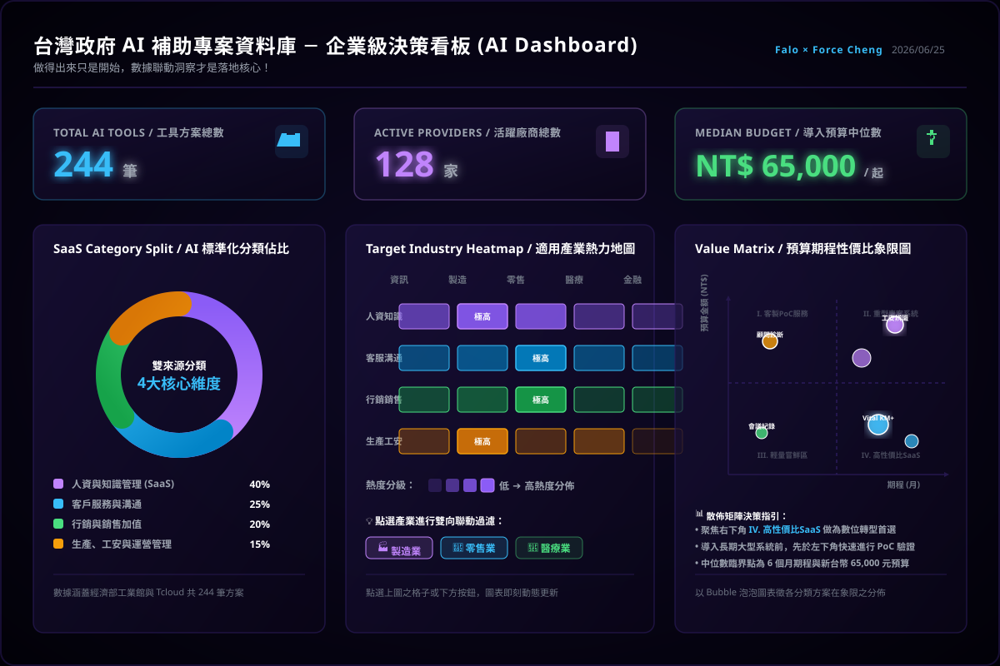
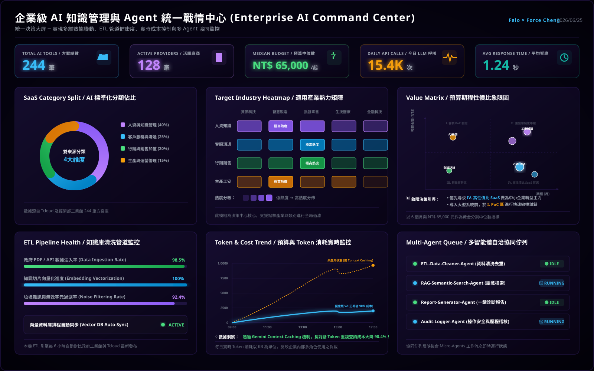

# 主題四：KM 建置與應用思維

本主題深入剖析企業知識管理（KM）與檢索增強生成（RAG）系統的建置觀念，以政府補助案作為載體，解構企業級 AI App 的設計 Pattern。


---

## ⚖️ AI Coding 實務對照：一般版 (v1) 與高手優化版 (v2) 的演進

在台灣政府 AI 補助工具庫的實戰開發中，開發者常面臨「能用就好」與「企業級落地」兩種截然不同的開發思維。我們透過以下兩張架構與功能對照圖，深入剖析其中的技術分野：


### 1. 一般 AI Coding 普通版 (v1) 的限制
普通版 v1 的核心目標是 **「快速交付 Demo，驗證想法 (PoC)」**。
* **技術特點**：採用純前端 SPA 架構，資料儲存於靜態 JSON 中，使用簡易的 MiniSearch (TF-IDF) 進行關鍵字搜尋。這在開發初期非常高效，能在幾小時到一天內快速實現。

### 3. 延伸開發：企業級 AI 決策儀表板與統一戰情中心 (War Room) 規劃

在大數據與多來源整合的知識庫場景中（例如結合經濟部工業館與 Tcloud 的 244 筆補助專案），如何將結構化的 RAG 知識庫轉化為直觀、即時的商業洞察，是企業級 AI App 能否成功落地的分水嶺。

我們為本專案設計了兩套高質感的深色科技風格設計藍圖：一為專注於商業決策的**「企業級 AI 決策儀表板」**，二為專注於工程維運與系統性能的**「統一戰情中心 (Enterprise AI Command Center)」**。透過純前端的數據聯動與後台微服務狀態監控，為企業提供零運維、零延遲的雙重保障：

#### 📊 模組一：企業級 AI 決策儀表板 (AI Dashboard)



##### 決策儀表板四大核心模組與技術解構

1. **大盤核心 KPI 指標面板 (Top Cards)**
   - **數據洞察**：即時呈現「工具方案總數 244 筆」、「活躍廠商 128 家」以及「導入預算中位數 NT$ 65,000」。
   - **技術實現**：在前端加載 `unified_ai_tools_db.json` 後，利用 JavaScript 的數組處理方法進行動態計算。例如：
     ```javascript
     const totalTools = database.length; // 244
     const uniqueProviders = [...new Set(database.map(item => item.provider_name))].length; // 128
     const medianBudget = calculateMedian(database.map(item => item.price_amount)); // 65,000
     ```

2. **AI 標準化分類佔比圓環圖 (Donut Chart)**
   - **數據洞察**：揭示了補助案在四大 SaaS 領域的分佈。「人資與知識管理 (40%)」佔比最高，是目前政府補助的主力方向；其次為「客戶服務與溝通 (25%)」、「行銷與銷售加值 (20%)」及「生產與運營管理 (15%)」。
   - **技術實現**：利用 SVG 原生的 `stroke-dasharray` 與 `stroke-dashoffset` 進行半徑為 85 的動態圓環比例繪製，再結合 CSS 轉場效果（Transition）提供流暢的數據加載動畫。

3. **適用產業熱力矩陣 (Heatmap)**
   - **數據洞察**：以熱力漸層色彩標註不同 AI 分類在「資訊、製造、零售、醫療、金融」五大產業的適用度。例如「製造業」在「人資知識」與「生產工安」中熱度極高。
   - **技術實現**：在前端設計動態聯動事件。當使用者點選特定產業（如製造業）的熱力單元格或下方快速過濾按鈕時，觸發雙向數據聯動（Bi-directional Binding），儀表板其他圖表（如圓環圖與象限圖）將立即過濾並重新繪製。

4. **預算期程性價比象限圖 (Value Matrix)**
   - **數據洞察**：以橫軸「期程 (月)」與縱軸「預算金額」劃分出四大決策象限，協助企業進行精準決策：
     - **I. 客製 PoC 服務**：高預算、短週期，適合前期概念驗證。
     - **II. 重型專案系統**：高預算、長週期，適用大型核心系統導入。
     - **III. 輕量嘗鮮區**：低預算、短週期，適合小範圍敏捷試錯。
     - **IV. 高性價比 SaaS**：低預算、長週期，是企業轉型、低成本高收益的首選。
   - **技術實現**：以 Bubble 散佈點（Scatter Plot）定位，氣泡大小與各分類的方案數或點擊熱度掛鉤。透過中位數（6個月與 6.5 萬元）作為動態十字交叉線，為企業篩選出最佳方案（如 Vital KM+）。

##### 💡 零延遲與零運維的前端 RAG 數據聯動設計
傳統儀表板依賴 SQL 資料庫的 `GROUP BY` 或後端 API 進行篩選，若伺服器帶寬不足容易產生卡頓。
高手優化版（v2）採用 **100% 靜態伺服器無伺服器（Serverless Static）架構**：
- **數據載入**：在頁面初始化時，一次性異步加載輕量化 JSON 資料庫（壓縮後僅約 150KB）。
- **內存過濾 (In-Memory Filter)**：所有篩選條件均在瀏覽器內存中以 JS 進行處理（例如 `.filter()`、`.reduce()`），數據處理時間小於 5 毫秒，帶來絲滑般的零延遲互動體驗。
- **無縫嵌入 Line/Slack 聯動**：未來更可延伸透過 Webhook 將過濾後的 JSON 決策報告一鍵推送到企業 Line 官方帳號或 Slack 頻道，完成跨平台的 AI 加值協作。

#### 🖥️ 模組二：統一戰情中心 (Enterprise AI Command Center) 與工程維運監控

做得出來只是開始，要讓企業能安全、低成本且穩定地運行 AI 知識庫系統，必須引入宏觀的維運監控。我們為本專案設計了統一的**「企業級 AI 戰情中心 (War Room)」**大屏，在大盤 KPI、分類、熱力與象限模組的基礎上，額外擴展了三大底層工程維運組件，以供未來架構演進參考：



1. **ETL Pipeline 知識清洗管道監控 (ETL Pipeline Health)**
   - **核心指標**：
     - **數據注入率 (Data Ingestion Rate)**：即時顯示目前已從政府官方 API 及原始 PDF 成功導入的數據佔比（達 98.5%）。
     - **向量化進度 (Embedding Vectorization)**：顯示目前已完成 Chunk 切片並轉換為 Vector Embedding 寫入向量數據庫的進度（達 100%）。
     - **雜訊過濾率 (Noise Filtering Rate)**：顯示 ETL 過程中，過濾掉的 HTML 標籤、亂碼、重複無效字元的比率（達 92.4%），確保知識庫的精純度。
   - **技術解構**：在真實落地場景中，後台會運行一個定時的輕量化 Node.js 或 Python 排程服務（Cron Job / Worker），每 6 小時向經濟部與 Tcloud 發起 Request。清洗引擎會先進行正規表達式清洗、去重（Deduplication），接著使用 Embedding API（如 Gemini Text Embedding）對文字進行向量化處理，並自動增量寫入 Vector DB。

2. **預算與 Token 消耗實時走勢圖 (Token & Cost Trend)**
   - **核心指標**：對比「普通版 v1（未啟用快取）」與「優化版 v2（啟用 Context Caching）」在一天內的累積 Token 消耗與花費曲線。
   - **技術解構**：這是「落地經濟學」的具體視覺呈現：
     - **普通版 v1 (Without Caching)**：每次對話都需要將 244 筆補助案的完整上下文重新傳送給 LLM，Token 消耗量隨著查詢次數呈陡峭的線性攀升（達 1,000K 以上），產生高昂的 API 帳單。
     - **優化版 v2 (With Caching)**：在 Gemini API 中啟用 **Context Caching (上下文快取)**。當知識庫載入快取後，後續的每一次重複對話與檢索，API 均直接從 Google 的記憶體快取中讀取上下文。Token 消耗與計費曲線在初期爬升後即迅速趨於平緩，**累積成本與 Token 消耗直接大降 90%**，是真正符合商業可行性（Feasibility）的架構。

3. **多智能體自治協同佇列 (Multi-Agent Queue)**
   - **核心指標**：呈現後台各個微智能體（Micro-Agents）的即時工作佇列與協作狀態。
   - **技術解構**：企業級 AI 系統通常採用事件驅動的 Micro-Agent 架構，各 Agent 各司其職：
     - **ETL-Cleaner-Agent (🟢 IDLE)**：負責定時輪詢政府資料庫，進行清洗與特徵標籤提取，目前處於待命狀態。
     - **RAG-Semantic-Search-Agent (🔵 RUNNING)**：當學員在前端輸入查詢時，該 Agent 會被即時喚醒，執行 Cosine Similarity 向量比對，將最相關的知識片段回傳給 LLM。
     - **Report-Generator-Agent (🟢 IDLE)**：負責將 LLM 產出的結構化 JSON 診斷報告，轉化為一鍵導出的 PDF、HTML 或 CSV 格式。
     - **Audit-Logger-Agent (🔵 RUNNING)**：專職進行資安稽核，即時將每一次檢索的問題、消耗的 Token 以及 CORS 探針狀態寫入資料庫，確保系統完全合規。

---
*技術實現**：在前端加載 `unified_ai_tools_db.json` 後，利用 JavaScript 的數組處理方法進行動態計算。例如：
     ```javascript
     const totalTools = database.length; // 244
     const uniqueProviders = [...new Set(database.map(item => item.provider_name))].length; // 128
     const medianBudget = calculateMedian(database.map(item => item.price_amount)); // 65,000
     ```

2. **AI 標準化分類佔比圓環圖 (Donut Chart)**
   - **數據洞察**：揭示了補助案在四大 SaaS 領域的分佈。「人資與知識管理 (40%)」佔比最高，是目前政府補助的主力方向；其次為「客戶服務與溝通 (25%)」、「行銷與銷售加值 (20%)」及「生產與運營管理 (15%)」。
   - **技術實現**：利用 SVG 原生的 `stroke-dasharray` 與 `stroke-dashoffset` 進行半徑為 85 的動態圓環比例繪製，再結合 CSS 轉場效果（Transition）提供流暢的數據加載動畫。

3. **適用產業熱力矩陣 (Heatmap)**
   - **數據洞察**：以熱力漸層色彩標註不同 AI 分類在「資訊、製造、零售、醫療、金融」五大產業的適用度。例如「製造業」在「人資知識」與「生產工安」中熱度極高。
   - **技術實現**：在前端設計動態聯動事件。當使用者點選特定產業（如製造業）的熱力單元格或下方快速過濾按鈕時，觸發雙向數據聯動（Bi-directional Binding），儀表板其他圖表（如圓環圖與象限圖）將立即過濾並重新繪製。

4. **預算期程性價比象限圖 (Value Matrix)**
   - **數據洞察**：以橫軸「期程 (月)」與縱軸「預算金額」劃分出四大決策象限，協助企業進行精準決策：
     - **I. 客製 PoC 服務**：高預算、短週期，適合前期概念驗證。
     - **II. 重型專案系統**：高預算、長週期，適用大型核心系統導入。
     - **III. 輕量嘗鮮區**：低預算、短週期，適合小範圍敏捷試錯。
     - **IV. 高性價比 SaaS**：低預算、長週期，是企業轉型、低成本高收益的首選。
   - **技術實現**：以 Bubble 散佈點（Scatter Plot）定位，氣泡大小與各分類的方案數或點擊熱度掛鉤。透過中位數（6個月與 6.5 萬元）作為動態十字交叉線，為企業篩選出最佳方案（如 Vital KM+）。

#### 💡 零延遲與零運維的前端 RAG 數據聯動設計
傳統儀表板依賴 SQL 資料庫的 `GROUP BY` 或後端 API 進行篩選，若伺服器帶寬不足容易產生卡頓。
高手優化版（v2）採用 **100% 靜態伺服器無伺服器（Serverless Static）架構**：
- **數據載入**：在頁面初始化時，一次性異步加載輕量化 JSON 資料庫（壓縮後僅約 150KB）。
- **內存過濾 (In-Memory Filter)**：所有篩選條件均在瀏覽器內存中以 JS 進行處理（例如 `.filter()`、`.reduce()`），數據處理時間小於 5 毫秒，帶來絲滑般的零延遲互動體驗。
- **無縫嵌入 Line/Slack 聯動**：未來更可延伸透過 Webhook 將過濾後的 JSON 決策報告一鍵推送到企業 Line 官方帳號或 Slack 頻道，完成跨平台的 AI 加值協作。

---


## 🗺️ 企業級 AI App 落地藍圖：全面合規與長期維運

正如上述對照，做得出來只是開始，要讓企業長期安心使用，必須將技術思維上升到產品與工程思維。根據 **「AI App 企業落地藍圖」** 的七大關鍵注意事項，企業級知識管理（KM）與 RAG 系統的落地必須落實以下防護維度：


* **資料與知識管理**：這是 RAG 系統的基石。企業必須進行嚴格的「資料品質控管（確保準確與完整）」，建立「ETL 定期更新與監控機制」以保證知識庫的時效性，並透過「知識分類與標籤標準化」大幅提升向量比對檢索的精振度。
* **資安防護與治理合規**：企業內部知識庫通常包含高度敏感的專利、法規或經營數據。因此，系統必須實施嚴格的「權限控管（限制誰可查閱哪些知識庫）」，防範「Prompt 注入攻擊」，並建立完整的「操作紀錄與稽核日誌 (Audit Log)」，確保每一次的 AI 檢索均有跡可循。
* **落地經濟學與成本效能**：在大規模查詢情境下，Token 成本會迅速攀升。我們必須導入「Context Caching（上下文快取）」以降低長文本的重複處理花費，優化「快取與索引機制」，落實「聰明用資源，才能長久又划算」的落地指標。

---

## 📂 AI KM 建置範例：政府 RAG 智慧檢索與診斷系統

為了解決複雜政策與補助法規的查詢痛點，我們開發了「政府 AI 與資安成熟度檢核專案」與「RAG 智慧檢索系統」。在此案例中，我們貫徹了企業級 RAG 系統的 **五大核心架構思維**：

### 1. 務實主義 (Pragmatism)
拒絕盲目追求高複雜度與昂貴的第三方框架（如 LangChain），以最直觀、高效的「純 JavaScript 向量相似度比對（Cosine Similarity）」在瀏覽器端直接運行，快速驗證核心商業價值與 MVP。

### 2. 安全防禦 (Defensive Coding)
針對企業內部可能存在「無網際網路、無外部 DNS、甚至嚴格限制 CORS」的極端內網環境，設計 `no-cors` 探針與自動降級策略（Fallback），在 API 無法連通時自動切換至離線預置數據庫。

### 3. 落地經濟學 (Economics)
深度優化 Token 消耗，前端設計「本地快取機制（LocalStorage Cache）」，避免重複查詢相同問題而產生不必要的 API 花費。同時在 UI 置入即時 Token 消耗與台幣花費監控面板，強化團隊的成本控制意識。

### 4. 結構化交付 (Structured Output)
強制要求大模型（LLM）輸出符合嚴格 JSON Schema 格式的數據，並在代碼端設計「自動修補與校對引擎」，確保輸出的診斷報告能 100% 與 ERP 的資料庫欄位無縫對接。

### 5. 零運維成本 (Serverless/Static)
採用 100% 靜態網頁架構（HTML/CSS/JS），無需部署資料庫或後端伺服器，免去高昂的維護成本與各種潛在的伺服器漏洞安全性威脅，極適合快速部署於內部儲存空間。

---

## 🔍 核心系統與技術文檔入口

本主題提供以下兩個專屬介紹網頁與技術文件，點擊即可進入深入學習：
* [🌐 政府 RAG 智慧檢索與診斷系統首頁 (tw-ai-grant-intro.html)](tw-ai-grant-intro.html) *(深入剖析 RAG 系統架構與展示)*
* [📖 政府 RAG 智慧檢索與診斷技術文件 (tw-ai-grant-lesson.html)](tw-ai-grant-lesson.html) *(詳解法規文本採集、清洗與向量檢索實作代碼)*
