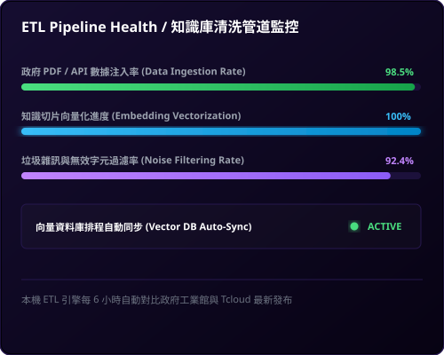
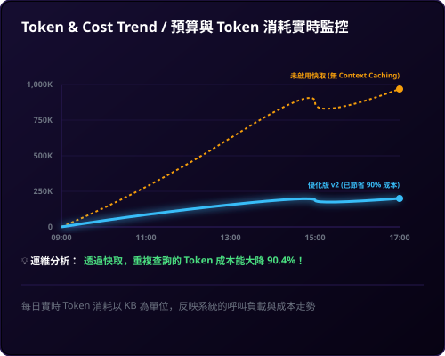
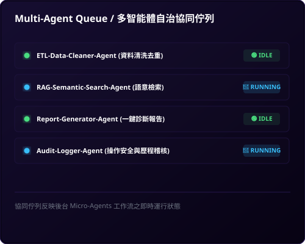

# 主題四：KM 建置與應用思維

本主題深入剖析企業知識管理（KM）與檢索增強生成（RAG）系統的建置觀念，以政府補助案作為載體，解構企業級 AI App 的設計 Pattern。

---

## ⚖️ AI Coding 實務對照：一般版 (v1) 與高手優化版 (v2) 的演進

在台灣政府 AI 補助工具庫的實戰開發中，開發者常面臨「能用就好」與「企業級落地」兩種截然不同的開發思維。我們透過以下兩張架構與功能對照圖，深入剖析其中的技術分野：

### 1. 一般 AI Coding 普通版 (v1) 的限制
普通版 v1 的核心目標是 **「快速交付 Demo，驗證想法 (PoC)」**。
* **技術特點**：採用純前端 SPA 架構，資料儲存於靜態 JSON 中，使用簡易的 MiniSearch (TF-IDF) 進行關鍵字搜尋。這在開發初期非常高效，能在幾小時到一天內快速實現。

### 3. 延伸開發：企業級 AI 統一戰情中心 (War Room) 與元件解構

在大數據與多來源整合的知識庫場景中（例如結合經濟部工業館與 Tcloud 的 244 筆補助專案），如何將結構化的 RAG 知識庫轉化為直觀、即時的商業洞察，是企業級 AI App 能否成功落地的分水嶺。這對應了企業級知識庫的 **Load (L) 階段**，即數據的加載、生命週期管理、實時成本控制與系統監控。

我們為本專案設計了一套高質感的深色科技風格**「企業級 AI 統一戰情中心 (Enterprise AI Command Center)」**，做為未來架構演進的概念參考。

#### 🖥️ 統一戰情中心大屏藍圖 (Enterprise AI War Room)
戰情中心大屏將商業決策數據與工程維運監控融為一體，實現全局數據的統一呈現：

為了讓學員深刻理解每一項指標的設計意圖與底層工程原理，我們將此戰情中心物理拆解為 **七大核心儀表板元件**，逐一進行視覺展示與深度技術解構：

---

#### 📂 戰情中心七大核心元件逐一解構

##### 1. 大盤核心 KPI 指標面板 (Top Cards)

* **商業洞察**：即時呈現「工具方案總數 244 筆」、「活躍廠商 128 家」、「導入預算中位數 NT$ 65,000」、「今日 API 呼叫次數 15.4K」以及「平均響應時間 1.24 秒」。這組指標能讓決策者秒級掌握系統負載與數據規模。
* **技術實現**：在前端異步加載靜態  資料庫（壓縮後僅約 150KB），在內存中通過高效的 JavaScript 數組處理（如 、）動態計算指標，保證 0 延遲加載。

##### 2. AI 標準化分類佔比圓環圖 (Donut Chart)

* **商業洞察**：揭示了補助案在四大 SaaS 領域的分佈。「人資與知識管理 (40%)」佔比最高，是目前政府補助的主力方向；其次為「客戶服務與溝通 (25%)」、「行銷與銷售加值 (20%)」及「生產與運營管理 (15%)」。這能引導企業將資源優先投入最易獲得政府補助的領域。
* **技術實現**：採用 SVG 原生的  與  動態圓環比例繪製，結合 CSS  提供極致流暢的加載動畫，完全避免了第三方圖表庫（如 Chart.js）帶來的打包體積膨脹。

##### 3. 適用產業熱力矩陣 (Heatmap)

* **商業洞察**：以熱力漸層色彩標註不同 AI 分類在「資訊、製造、零售、醫療、金融」五大產業的適用度。例如「製造業」在「人資知識」與「生產工安」中熱度極高，能幫助企業進行精準的 SaaS 定位。
* **技術實現**：設計成全局過濾器。當使用者在前端點選矩陣中的特定格子時，會觸發雙向聯動，整個戰情中心的數據（包括圓環圖與象限圖）將立即根據該產業過濾並重新渲染。

##### 4. 預算期程性價比象限圖 (Value Matrix)

* **商業洞察**：以橫軸「期程 (月)」與縱軸「預算金額」劃分出四大決策象限，協助企業進行精準決策：
  - **I. 客製 PoC 服務**：高預算、短週期，適合前期概念驗證。
  - **II. 重型專案系統**：高預算、長週期，適用大型核心系統導入。
  - **III. 輕量嘗鮮區**：低預算、短週期，適合小範圍敏捷試錯。
  - **IV. 高性價比 SaaS**：低預算、長週期，是企業轉型、低成本高收益的首選（如 Vital KM+）。
* **技術實現**：利用 SVG 散佈點（Scatter Plot）定位，氣泡大小與方案熱度掛鉤。透過黃金中位數（6個月期程與 6.5 萬元預算）作為十字交叉線，為企業自動篩選出最優轉型路徑。

##### 5. ETL Pipeline 知識清洗管道監控 (ETL Pipeline Health)

* **商業洞察**：即時掌握企業知識庫的注入質量，確保決策數據的「準確性、時效性與潔淨度」。包含「數據注入率 (98.5%)」、「向量化進度 (100%)」以及「雜訊過濾率 (92.4%)」，並實時反饋向量資料庫的排程同步狀態（ACTIVE）。
* **技術實現**：後台微服務（Cron Job Worker）每 6 小時自動抓取最新補助案數據，執行正則過濾、Html 去除、段落去重，隨後調用 Text Embedding API 進行向量化，並以增量方式安全 Load 入 Vector DB 中。

##### 6. 預算與 Token 消耗實時走勢圖 (Token & Cost Trend)

* **商業洞察**：直觀對比「普通版 v1（未啟用快取）」與「優化版 v2（啟用 Context Caching）」在一天內的累積 Token 消耗與花費曲線，將「落地經濟學」的威力以視覺化指標呈獻給決策者。
* **技術實現**：優化版 v2 導入了 **Gemini Context Caching (上下文快取)**。當大篇幅補助案知識庫載入快取後，重複的查詢直接命中記憶體快取，使得累積 Token 消耗曲線在初期爬升後即趨於平緩，**成本大降 90.4%**，是真正符合商業可行性的架構設計。

##### 7. 多智能體自治協同佇列 (Multi-Agent Queue)

* **商業洞察**：展示後台各個微智能體（Micro-Agents）的即時協同狀態，讓運維人員掌握系統異步處理的流水線（Pipeline）健康度。
* **技術實現**：採用事件驅動的微服務架構：
  - **ETL-Cleaner-Agent (🟢 IDLE)**：定時輪詢並清洗數據，目前處於休眠待命。
  - **RAG-Semantic-Search-Agent (🔵 RUNNING)**：當學員在前端輸入查詢時被即時喚醒，執行向量相似度比對。
  - **Report-Generator-Agent (🟢 IDLE)**：負責一鍵將診斷報告轉化為 HTML/PDF 格式導出。
  - **Audit-Logger-Agent (🔵 RUNNING)**：即時將查詢歷程、Token 花費與 API 安全狀態寫入稽核日誌。

---

## 🗺️ 企業級 AI App 落地藍圖：全面合規與長期維運

正如上述對照，做得出來只是開始，要讓企業長期安心使用，必須將技術思維上升到產品與工程思維。根據 **「AI App 企業落地藍圖」** 的七大關鍵注意事項，企業級知識管理（KM）與 RAG 系統的落地必須落實以下防護維度：

* **資料與知識管理**：這是 RAG 系統的基石。企業必須進行嚴格的「資料品質控管（確保準確與完整）」，建立「ETL 定期更新與監控機制」以保證知識庫的時效性，並透過「知識分類與標籤標準化」大幅提升向量比對檢索的精振度。
* **資安防護與治理合規**：企業內部知識庫通常包含高度敏感的專利、法規或經營數據。因此，系統必須實施嚴格的「權限控管（限制誰可查閱哪些知識庫）」，防範「Prompt 注入攻擊」，並建立完整的「操作紀錄與稽核日誌 (Audit Log)」，確保每一次的 AI 檢索均有跡可循。
* **落地經濟學與成本效能**：在大規模查詢情境下，Token 成本會迅速攀升。我們必須導入「Context Caching（上下文快取）」以降低長文本的重複處理花費，優化「快取與索引機制」，落實「聰明用資源，才能長久又划算」的落地指標。

---

## 📂 AI KM 建置範例：政府 RAG 智慧檢索與診斷系統

為了解決複雜政策與補助法規的查詢痛點，我們開發了「政府 AI 與資安成熟度檢核專案」與「RAG 智慧檢索系統」。在此案例中，我們貫徹了企業級 RAG 系統的 **五大核心架構思維**：

### 1. 務實主義 (Pragmatism)
拒絕盲目追求高複雜度與昂貴的第三方框架（如 LangChain），以最直觀、高效的「純 JavaScript 向量相似度比對（Cosine Similarity）」在瀏覽器端直接運行，快速驗證核心商業價值與 MVP。

### 2. 安全防禦 (Defensive Coding)
針對企業內部可能存在「無網際網路、無外部 DNS、甚至嚴格限制 CORS」的極端內網環境，設計 `no-cors` 探針與自動降級策略（Fallback），在 API 無法連通時自動切換至離線預置數據庫。

### 3. 落地經濟學 (Economics)
深度優化 Token 消耗，前端設計「本地快取機制（LocalStorage Cache）」，避免重複查詢相同問題而產生不必要的 API 花費。同時在 UI 置入即時 Token 消耗與台幣花費監控面板，強化團隊的成本控制意識。

### 4. 結構化交付 (Structured Output)
強制要求大模型（LLM）輸出符合嚴格 JSON Schema 格式的數據，並在代碼端設計「自動修補與校對引擎」，確保輸出的診斷報告能 100% 與 ERP 的資料庫欄位無縫對接。

### 5. 零運維成本 (Serverless/Static)
採用 100% 靜態網頁架構（HTML/CSS/JS），無需部署資料庫或後端伺服器，免去高昂的維護成本與各種潛在的伺服器漏洞安全性威脅，極適合快速部署於內部儲存空間。

---

## 🔍 核心系統與技術文檔入口

本主題提供以下兩個專屬介紹網頁與技術文件，點擊即可進入深入學習：
* [🌐 政府 RAG 智慧檢索與診斷系統首頁 (tw-ai-grant-intro.html)](tw-ai-grant-intro.html) *(深入剖析 RAG 系統架構與展示)*
* [📖 政府 RAG 智慧檢索與診斷技術文件 (tw-ai-grant-lesson.html)](tw-ai-grant-lesson.html) *(詳解法規文本採集、清洗與向量檢索實作代碼)*
