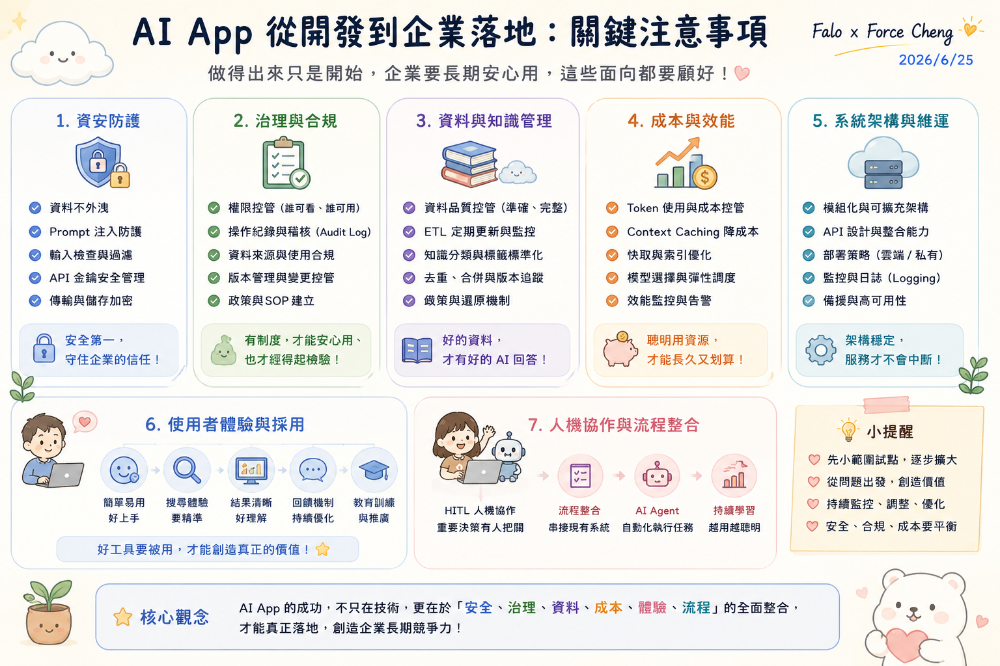

# 主題五：AI App 專案腦力激盪

本主題收錄完整的「AI APP Studio 工作坊」實戰框架，引導同仁從痛點出發，共創銀河 ERP × FALO AI App Store 的產品藍圖。本專案將 AI App 創意與需求池物理性地劃分為三大核心業務方向。

---

## 🗺️ AI App 落地評估指標：工作坊專案設計的終極指引

在 **AI App Studio 工作坊** 中，我們不僅要激發同仁的創意，更需要引導大家以「企業級落地」的高度來評估與設計每一個 AI App 專案。當團隊在進行腦力激盪、填寫需求 Backlog 或規劃 MVP 時，必須參考這份完整的 **「AI App 企業落地關鍵注意事項」** 查檢表：

* **使用者體驗與採用**：這是產品成功的起點。一個 AI App 如果沒人使用，就無法創造價值。設計時必須確保「簡單易用好上手」，提供「精準的搜尋與交互體驗」，並在前期就規劃好「教育訓練與推廣計畫」。
* **人機協作與流程整合**：企業級 AI App 絕非完全脫離人工的黑盒子。我們必須設計 **「HITL (Human-in-the-Loop) 人機協作機制」**，讓關鍵決策始終有同仁把關；並逐步完成從「流程整合（串接現有 ERP 系統）」到「AI Agent 自動化執行任務」的演進，使系統越用越聰明。
* **系統架構與穩定維運**：在設計 MVP 與 PoC 時，就必須考慮未來的擴充性。應採用「模組化與可擴充架構」，優化「API 設計與整合能力」，並在前期就建立完善的「監控與日誌 (Logging)」策略，以確保系統架構穩定，服務不中斷。

---

## 🛡️ 企業部署實戰：FALO 閘道相容性與防火牆檢測工具 (Firewall Test)

在進行 AI App 的專案腦力激盪、MVP（最小可行性產品）與 PoC（概念驗證）規劃時，團隊往往會面臨一個極具殺傷力的現實問題：**「這款 AI App 在企業內部高度安全的網絡環境下到底能不能通？」**

為了在 PoC 規劃初期就進行評估，避免 AI App 創意在部署階段面臨阻礙，我們將 **FALO Assessment Tool (Firewall Test)** 閘道與平台相容性評估工具納入本主題，作為 AI App 專案可行性評估的即戰力武器。
* 🌐 **[線上即時檢測工具入口 ➔ FALO Firewall Test](https://falo-taiwan.github.io/firewall-test/)**
* 📖 **[企業導入部署說明手冊 ➔ Firewall Test Readme](https://falo-taiwan.github.io/firewall-test/readme.html)**
* 💻 **本地運行版入口 ➔ [deployment-assessment.html](deployment-assessment.html)**

---

## 🎯 銀河 ERP × FALO AI App Store 三大業務方向產品藍圖

為引導同仁將日常工作的「痛點」轉化為「標準化 AI 產品」，我們規劃了代表未來升級方向的三大核心 AI App 業務方向。以下為各方向的產品定位、元件設計與具體用途：

### 方向 A：AI KM 政府與企業知識庫平台 (NotebookLM 延伸應用)
*   **業務定位**：解決企業在政策對接、法規檢索與政府補助案申請時面臨的「資訊碎片化」與「合規解讀難度高」等痛點。透過輕量前端檢索與上下文快取，打造低成本的公務知識平台。
*   **核心元件與用途**：
    1.  **台灣政府 AI 補助 RAG 智慧檢索系統 (PoC 實戰案)**：
        *   *用途*：整合 224 筆政府補助案資料庫，以純前端字元級 TF-IDF 檢索與 Gemini Context Caching 技術，提供秒級響應且降低 90% Token 成本的語意對話診斷，並自動渲染 HTML Notion 風格建議書。
    2.  **政策法規智慧問答助理**：
        *   *用途*：針對企業日常面臨的勞基法、稅務法規或環評標準，提供本地離線的智慧問答，確保敏感商業資料完全不出企業內網。
    3.  **補助資格自動精準比對器**：
        *   *用途*：學員可導入企業自身的財務、員工人數與技術指標，由 AI 自動與多管道政府補助資格進行精準的差補比對，給出最優申報路徑。

### 方向 B：銀河 ERP 企業配套軟體 (SaaS 智慧增強)
*   **業務定位**：作為 ERP 廠商（銀河軟體 台西分公司），將 AI 技術無縫融入現有 ERP 作業流程中，為企業客戶提供高價值的 SaaS 智慧增值配套，解決複雜表單輸入與財務憑證稽核的耗時痛點。
*   **核心元件與用途**：
    1.  **AAA-Evidence Hub 智慧憑證稽核系統**：
        *   *用途*：結合 OCR 影像辨識與 ETL 資料正規化引擎，自動採集並清洗發票、收據與出貨單等財務憑證，校正大模型輸出的噪聲數據，實現自動化帳務核銷。
    2.  **FALO ERP Form Helper (智慧填單助手)**：
        *   *用途*：運用 Chrome 瀏覽器外掛，將使用者的非結構化對話或電子郵件內容，自動解析並填入 ERP 系統的複雜表單中，實現「對話即填單」。
    3.  **iPAS 智慧刷題模擬器 (產線自動化測試與監控版)**：
        *   *用途*：模擬真實瀏覽器的 Swiping 刷題動作，結合 Vision AI 進行自動化高頻解題，並提供精準的 Token 消耗、費用診斷與延遲等即時 Telemetry 數據回報。

### 方向 C：個人與公司常用軟體 (日常效率倍增器)
*   **業務定位**：加速同仁日常行政事務、會議協作與知識提煉的通用型效率工具，全面釋放組織生產力。
*   **核心元件與用途**：
    1.  **Video to PPT 簡報影格智慧萃取工具**：
        *   *用途*：自動解析教育訓練影片，運用 OpenCV MAE 影格變化偵測與 dHash 結構去重，智慧萃取關鍵投影片影格並執行 OCR 摘要，快速產出培訓精華講義。
    2.  **本地離線合約與法務稽核助理**：
        *   *用途*：基於 Ollama 在本地運行輕量大模型（如 Gemma 4 或 Qwen 3），在 100% 物理隔離與隱私安全的前提下，快速審查並標註商業合約中的潛在法務風險。
    3.  **AI 會議記錄與 Action Item 自動生成器**：
        *   *用途*：將錄音逐字稿交由 AI 進行語意摘要，自動提煉出會議結論、核心決策與結構化的跨部門任務指派清單，實現高效追蹤。

---

## 學習目標
- 運用「痛點轉化矩陣」與產品思維方法論。
- 進行三階段工作坊，共創 50+ AI App 創意 Backlog。
- 評估與設計 MVP（最小可行性產品）與 PoC（概念驗證）規劃。

---

## 工作坊配套工具資源
*詳細的配套工具與手寫工作紙，請參閱左側導航最下方的**「其他參考資源」**專區。*
