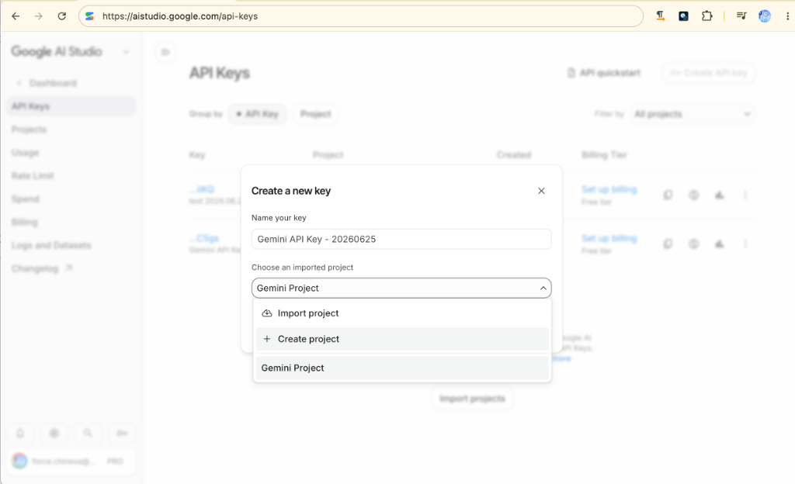
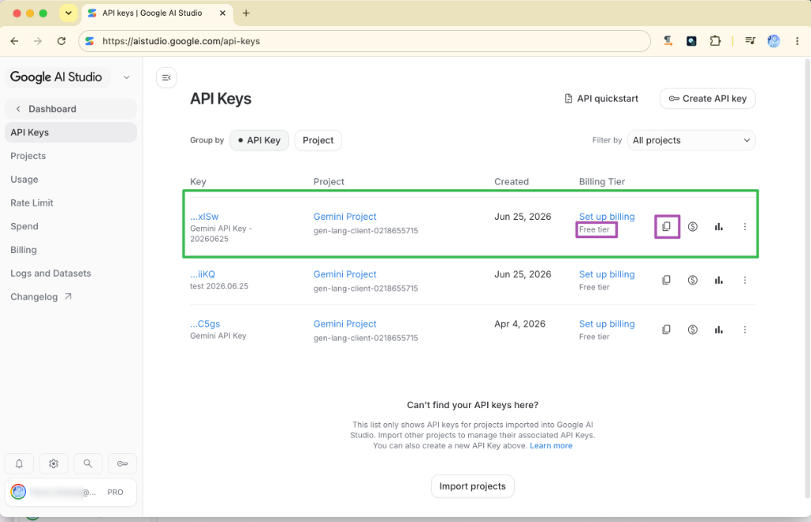
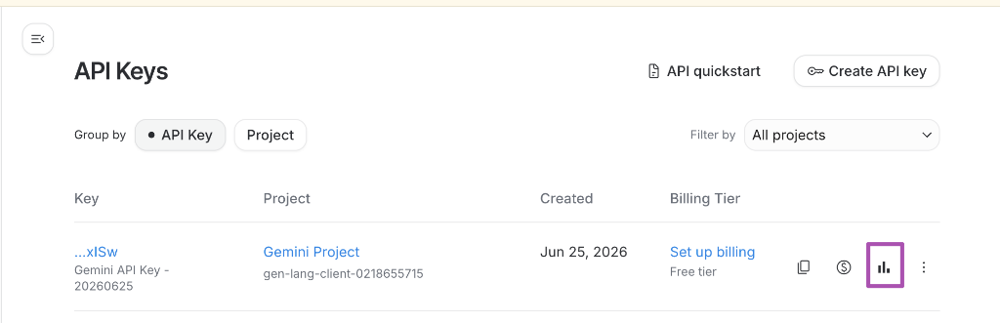

# 主題六：AI API 呼叫三大模式實戰

本主題旨在引導學員掌握當前主流的雲端、地端與瀏覽器原生三大 AI 呼叫技術，並提供最乾淨、符合企業實戰的前端 JavaScript/Fetch 程式碼範例與技術解構，讓學員可以直接在瀏覽器控制台 (Console) 或靜態網頁中貼上實測。

---

## 🚀 呼叫 AI 的三大運用模式：雲端、地端與瀏覽器原生 (Cloud vs Local vs Edge)

在進行 AI App 的實戰開發前，我們必須先掌握「如何呼叫 AI」的底層技術路徑。根據系統架構、資安防護、成本預算與運算延遲的不同， AI 呼叫主要分為以下三大經典模式。

### 1. 雲端 AI 呼叫：Google Gemini API (Cloud-based LLM)
*   **技術定位**：商業級雲端大模型 API。
*   **優勢**：模型推理解析力最強，支援超長上下文 (Context Window)，具備強大的多模態理解力，且完全免去本地硬體配置負擔。本範例採用 Google 最新一代主力模型 **Gemini 3.1 Flash** 與 **Gemini 3.1 Flash-Lite**。
*   **劣勢**：必須連接網際網路、有 API 調用成本 (按 Token 計費)、敏感數據直接送往雲端需注意隱私合規。

> [!IMPORTANT]
> **模型版本重要聲明**
> 請勿使用已停用或即將失效的舊版 **Gemini 1.5 系列 (如 gemini-1.5-flash)** 或較舊的 **Gemini 2.0 系列**，舊版模型在新版 API 通道中已無法正常運作或不具備最佳效能。本課程全面升級並採用最新的：
> 1. **`gemini-3.1-flash`**：預設主力模型，具備極佳的推理速度、代碼生成與多模態表現，適合絕大多數 AI App 實戰。
> 2. **`gemini-3.1-flash-lite`**：極速輕量化模型，回應延遲更低，Token 消耗成本極低，是高頻率查詢與 PoC 階段的首選。

---

### 📊 企業級落地經濟學：新世代 Gemini 家族 (3.5 / 3.1 / 2.5) 模型選型與路由指引

在真實的企業級 AI 專案（如天心 ERP 轉型或 AAA 憑證稽核）中，我們不可能盲目選用最貴的模型，否則 API 成本將會迅速吞噬產品利潤。這就引入了 **「落地經濟學 (Economics)」** 與 **「多模型級聯路由 (Cascade Routing)」** 的思維：在不同的處理階段、針對不同的任務難度，分流派遣最合適的模型廚師上陣。

#### 1. 新世代 Gemini 家族成員技術定位對比

| 模型名稱 | API 識別代碼 | 建議角色定位 | 適用場景與特色 |
| :--- | :--- | :--- | :--- |
| **Gemini 3.5 Flash** | `gemini-3.5-flash` | 🛡️ **高階深度審查 (Stronger Review)** | 小字辨識、複雜表格、手寫辨識、或第一輪結果衝突時的終極裁決者。具備最強推理與 Agent 行為。 |
| **Gemini 3.1 Flash** | `gemini-3.1-flash` | ⚡ **主流主力模型 (Main Engine)** | 預設主力，具備極佳的代碼生成、邏輯推理與多模態表現，效能與速度最為平衡。 |
| **Gemini 3.1 Flash-Lite** | `gemini-3.1-flash-lite` | 💸 **低成本快速草稿 (Low-cost Draft)** | 高頻率調用、PoC 概念驗證、第一版文字或 JSON 結構草稿提取。速度極快，成本極低。 |
| **Gemini 2.5 Flash** | `gemini-2.5-flash` | 📊 **基準教學比較 (Baseline Comparison)** | 用於歷史基準對照、一般教學或簡單問答，作為效能升級前後的對比點。 |
| **Gemini 2.5 Flash-Lite** | `gemini-2.5-flash-lite` | ⏳ **歷史低成本基準 (Older Lite Baseline)** | 用於歷史版本的低成本基準對照。 |

#### 2. 企業級多模型雙通道路由 (Cascade Router) 設計實戰

在處理高精度 OCR 或自動化報表稽核時，生產環境通常會採取 **「雙通道級聯 (Cascade)」** 策略：

*   **預設雙模型通道 (教學展示 / 一般效能)**：
    *   **第一步 (Draft)**：`gemini-2.5-flash` (舊版基準，快速生成初始比對)
    *   **第二步 (Review)**：`gemini-3.1-flash-lite` (極速精修，以低成本過濾輕量級任務)
*   **強化雙模型通道 (高精度 / 生產環境實戰)**：
    *   **第一步 (Draft)**：`gemini-3.1-flash-lite` (快速打草稿，過濾 90% 簡單任務)
    *   **第二步 (Review)**：`gemini-3.5-flash` (對剩餘 10% 複雜表格與小字做終極審核，發揮最大推理潛能)

---

*   **💡 實戰指引：手把手申請與複製 Gemini API Key 步驟**：
    在呼叫 API 之前，學員必須先取得專屬的 API Key。請遵循以下 7 個步驟進行申請與確認：
    
    1. **步驟一：前往 Google AI Studio 官方入口**
       請在瀏覽器搜尋「Google AI Studio API key」，或直接點選訪問 [https://aistudio.google.com/api-keys](https://aistudio.google.com/api-keys)。
       
       
    2. **步驟二：點擊創建 API Key**
       進入後台的「API Keys」介面後，點擊右上角紫色的 **「Create API key」** 按鈕。
       
       
    3. **步驟三：輸入 Key 的名稱與專案**
       在彈出的視窗中，為您的 API Key 命名（例如：`Gemini API Key - 20260625`），並選擇或創建您的 Google Cloud 專案。
       
       
    4. **步驟四：確認生成金鑰**
       點擊彈出對話框右下角的 **「Create key」** 按鈕。
       
       
    5. **步驟五：複製並安全保存金鑰**
       生成成功後，會顯示您的專屬 API Key（`AQ...`），點擊右下角的 **「Copy key」** 按鈕即可複製。請將此 Key 妥善保存，切勿公開洩漏！
       
       
    6. **步驟六：隨時管理與確認付費級別**
       回到金鑰列表中，您可以看見已建立的金鑰。請確認其 **Billing Tier 為「Free tier (免費級別)」**。此處不需綁定信用卡，學員即可安心進行免費額度內的 API 測試。您隨時可以點擊列表中的「Copy key (複製圖示)」重新複製金鑰。
       
       
    7. **步驟七：觀測與監控 API 使用量與 Token 消耗**
       在 API Key 列表中，點擊金鑰右側紫色的 **「用量統計按鈕 (圖表圖示)」**。
       
       
       這會引導您進入 **「Gemini API Usage (用量統計頁面)」**。在此頁面中，您可以即時觀測 Total API Requests (請求次數)、Total API Errors (錯誤次數)，以及每個模型的 Input/Output Tokens 消耗趨勢。這對於我們實作 AI 專案時進行 **「落地經濟學 (Economics)」** 的 Token 成本控制與用量監控至關重要！
       

*   **實戰前端 JavaScript 呼叫代碼**：
```javascript
/**
 * ☁️ 雲端 AI: Google Gemini API 呼叫範例 (支援最新一代 3.5 / 3.1 / 2.5 家族)
 * 
 * 💡 技術特色（參考生產環境規格實戰設計）：
 * 1. 【安全金鑰傳遞】：捨棄在 URL 暴露 API Key，改以 HTTP Header 'x-goog-api-key' 傳送，避免金鑰殘留在瀏覽器歷史紀錄或 proxy log 中。
 * 2. 【結構化 JSON 回傳】：展示如何利用 generationConfig 強制要求 Gemini 輸出 100% 合規的 JSON 格式，便於前端直接解析渲染。
 * 3. 【多模型切換路由】：支援動態傳入不同世代模型，讓學員親身體驗各世代（3.5 vs 3.1 vs 2.5）在推理能力與回應速度上的差異。
 */
async function callGemini(promptText, apiKey, options = {}) {
  const { 
    // 💡 支援模型名單 (modelName):
    // - 'gemini-3.5-flash'      (🛡️ 高階深度審查，最適合複雜邏輯、表格與手寫辨識)
    // - 'gemini-3.1-flash'      (⚡ 主流主力模型，預設，平衡效能與速度)
    // - 'gemini-3.1-flash-lite' (💸 低成本快速草稿，極速，超省用量)
    // - 'gemini-2.5-flash'      (📊 歷史基準教學比較)
    // - 'gemini-2.5-flash-lite' (⏳ 歷史低成本基準)
    modelName = 'gemini-3.1-flash', 
    responseJson = false           // 是否強制要求以 JSON 格式回傳
  } = options;

  // 建立符合 W3C 標準的 Gemini REST 端點 URL (支援動態傳入模型名稱)
  const url = `https://generativelanguage.googleapis.com/v1beta/models/${modelName}:generateContent`;
  
  const payload = {
    contents: [{
      parts: [{ text: promptText }]
    }],
    generationConfig: {}
  };

  // 💡 若指定 JSON 輸出，則透過 generationConfig 強制约束模型回傳 JSON 結構
  if (responseJson) {
    payload.generationConfig.responseMimeType = "application/json";
  }

  try {
    const response = await fetch(url, {
      method: 'POST',
      headers: {
        'Content-Type': 'application/json',
        'x-goog-api-key': apiKey // 🔑 安全傳遞：金鑰放於 Headers，比 query string 更安全
      },
      body: JSON.stringify(payload)
    });
    
    const data = await response.json();
    
    // 異常錯誤診斷與處理
    if (data.error) {
      throw new Error(data.error.message || "未知 API 錯誤");
    }
    
    // 從回傳結構中精準萃取文字
    const generatedText = data.candidates[0].content.parts[0].text;
    console.log(`[${modelName}] 原始輸出：\n`, generatedText);

    // 若指定 JSON 格式，則自動幫忙解析成 JS 物件
    if (responseJson) {
      try {
        return JSON.parse(generatedText);
      } catch (e) {
        console.warn("JSON 解析失敗，返回原始字串", e);
        return generatedText;
      }
    }
    
    return generatedText;
  } catch (error) {
    console.error(`Gemini (${modelName}) 呼叫失敗：`, error);
  }
}

// 💡 實測呼叫方式（學員可複製整段程式碼至瀏覽器 F12 Console 貼上運行）：
// 
// 1. 【普通文字模式】 使用預設的 Gemini 3.1 Flash：
// callGemini("請用繁體中文解釋什麼是 RAG 技術？", "YOUR_GEMINI_API_KEY");
//
// 2. 【高階深度審查模式】 使用最強的 Gemini 3.5 Flash 處理複雜任務：
// callGemini("請分析此程式碼的潛在記憶體洩漏風險：[在此貼上您的代碼]", "YOUR_GEMINI_API_KEY", { modelName: "gemini-3.5-flash" });
//
// 3. 【極速低成本模式】 使用更划算的 Gemini 3.1 Flash-Lite：
// callGemini("請寫一首關於寫程式的五言絕句。", "YOUR_GEMINI_API_KEY", { modelName: "gemini-3.1-flash-lite" });
//
// 4. 【歷史基準對照模式】 使用前代 Gemini 2.5 Flash 做對比測試：
// callGemini("什麼是落地經濟學？", "YOUR_GEMINI_API_KEY", { modelName: "gemini-2.5-flash" });
//
// 5. 【結構化 JSON 模式】 要求模型輸出特定 JSON 物件 (以 3.1 Flash 進行精密分析)：
// const jsonPrompt = `分析這封客戶信件的情感與急迫性。
// 信件內容：「我今天早上訂的系統到現在都無法登入，請立刻處理！」
// 請務必只回傳符合以下格式的 JSON 內容，不要包含額外文字：
// {
//   "sentiment": "正面/中立/負面",
//   "urgency": "高/中/低",
//   "summary": "一句話摘要"
// }`;
// callGemini(jsonPrompt, "YOUR_GEMINI_API_KEY", { responseJson: true });
```

---

### 2. 地端 AI 呼叫：Ollama 服務 (Local-based LLM)
*   **技術定位**：地端部署之開源模型伺服器。
*   **優勢**：100% 數據隱私安全（敏感商業資料完全不出企業內網）、零 Token 調用費用、可在無外網連線的物理隔離環境下穩定運作。
*   **劣勢**：極度依賴本地硬體算力（需要足夠的 GPU 顯示卡與視訊記憶體），且本地部署的模型參數規模（如 8B, 14B）其推理能力與雲端超大型模型相比仍有差距。
*   **實戰前端 JavaScript 呼叫代碼**：
```javascript
// 🏠 地端 AI: Ollama 本地 API 呼叫範例 (非串流模式)
async function callOllama(promptText, modelName = 'llama3') {
  // 本地 Ollama 預設的生成端點
  const url = 'http://localhost:11434/api/generate';
  
  const payload = {
    model: modelName,
    prompt: promptText,
    stream: false // 💡 設定為 false 關閉串流，直接返回完整 JSON，便於前端解析
  };

  try {
    const response = await fetch(url, {
      method: 'POST',
      headers: {
        'Content-Type': 'application/json'
      },
      body: JSON.stringify(payload)
    });
    
    const data = await response.json();
    const generatedText = data.response;
    console.log("Ollama 輸出：\n", generatedText);
    return generatedText;
  } catch (error) {
    console.error("Ollama 本地連線失敗，請確保本地 Ollama 已啟動且跨來源資源共用 (CORS) 已放行！\n錯誤資訊：", error);
    // 💡 避坑指引：若在前端網頁中直接 fetch 本地 API 遇到 CORS 阻擋
    // macOS/Linux 環境下請在啟動 Ollama 前，於終端機執行：export OLLAMA_ORIGINS="*"
    // Windows 環境下請在系統環境變數中新增 OLLAMA_ORIGINS 變數，值設定為 *，然後重啟 Ollama
  }
}

// 💡 實測呼叫：確保本地已執行 `ollama run llama3`
// callOllama("請用繁體中文自我介紹。");
```

---

### 3. 瀏覽器原生 AI 呼叫：Chrome built-in AI (Edge-based LLM)
*   **技術定位**：端側邊緣運算 (Edge AI)，大模型直接內嵌並運行於使用者的瀏覽器沙盒中。
*   **優勢**：真正的零伺服器運維成本、零網絡頻寬依賴（完全在使用者本地設備 CPU/NPU 運行）、極高隱私度，能大幅度減輕企業伺服器的算力負載。
*   **劣勢**：屬於極限輕量化模型（Gemini Nano 約 1.8B–3.2B 參數），僅適合進行簡易的文本摘要、翻譯、改寫、情感分析或意圖分類任務；目前僅限特定版本 Chrome 瀏覽器，且使用者需手動啟用實驗性 Flag。
*   **實戰前端 JavaScript 呼叫代碼**：
```javascript
// 🌐 瀏覽器原生 AI: Chrome built-in AI (Gemini Nano) 呼叫範例
async function callChromeNano(promptText) {
  // 1. 偵測瀏覽器是否支援且已啟用內建 AI API (W3C 草案標準)
  if (!window.ai || !window.ai.languageModel) {
    console.warn("當前瀏覽器不支援 Chrome 內建 AI。\n請確保使用的是 Chrome M127+，且已在 chrome://flags 啟用 'Built-in AI' 與 'Prompt API'。");
    return;
  }

  try {
    // 2. 檢查內建模型是否就緒與可用性
    const capabilities = await window.ai.languageModel.capabilities();
    if (capabilities.available === "no") {
      console.error("內建 Gemini Nano 模型尚未下載或無法在當前系統環境下使用。");
      return;
    }

    // 3. 建立 AI 會話 Session
    console.log("正在初始化 Chrome 內建 Gemini Nano Session...");
    const session = await window.ai.languageModel.create();

    // 4. 發送 Prompt 請求並取得回應 (非串流)
    console.log("發送 Prompt...");
    const response = await session.prompt(promptText);
    console.log("Chrome Nano 輸出：\n", response);
    
    // 5. 💡 避坑指引：使用完畢後務必摧毀 Session 以釋放瀏覽器記憶體
    session.destroy();
    return response;
  } catch (error) {
    console.error("Chrome Nano 執行失敗：", error);
  }
}

// 💡 實測呼叫：在符合條件的 Chrome 控制台直接執行
// callChromeNano("請將這句話翻譯成英文：今天天氣真好。");
```
