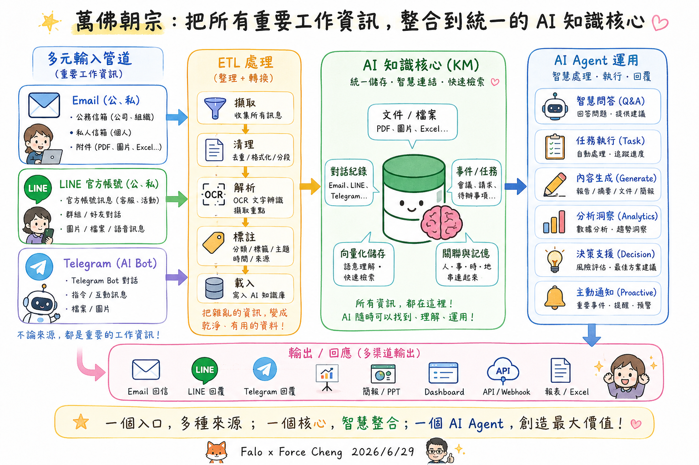
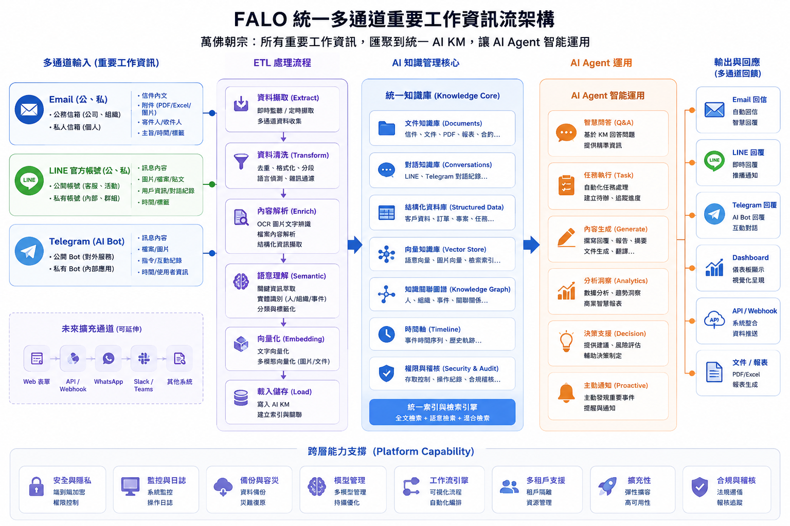
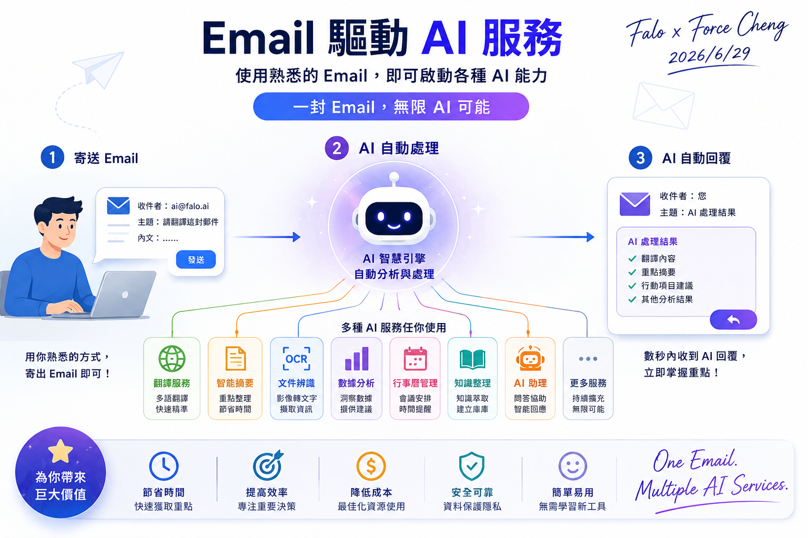
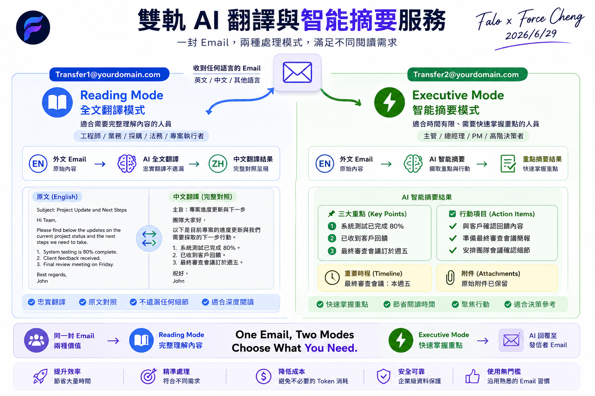
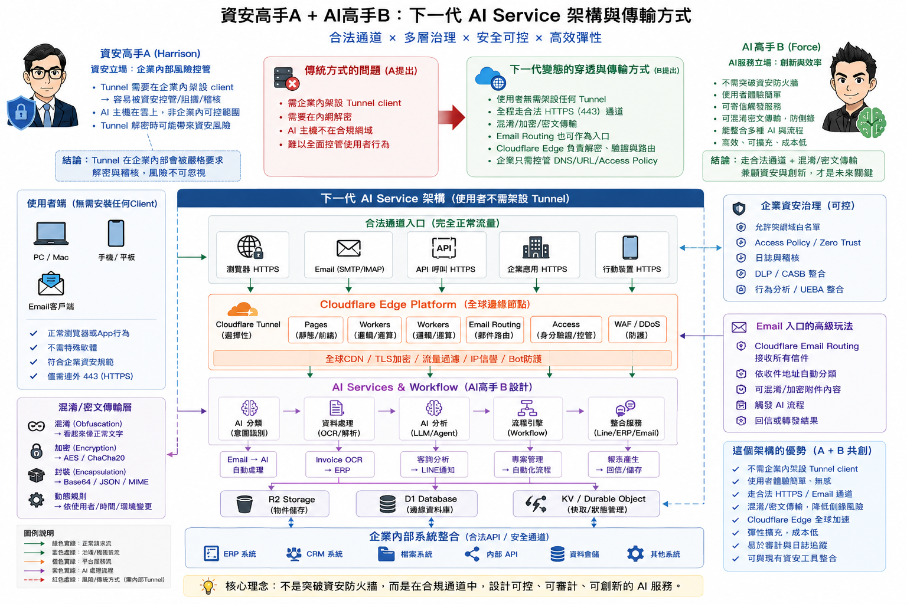
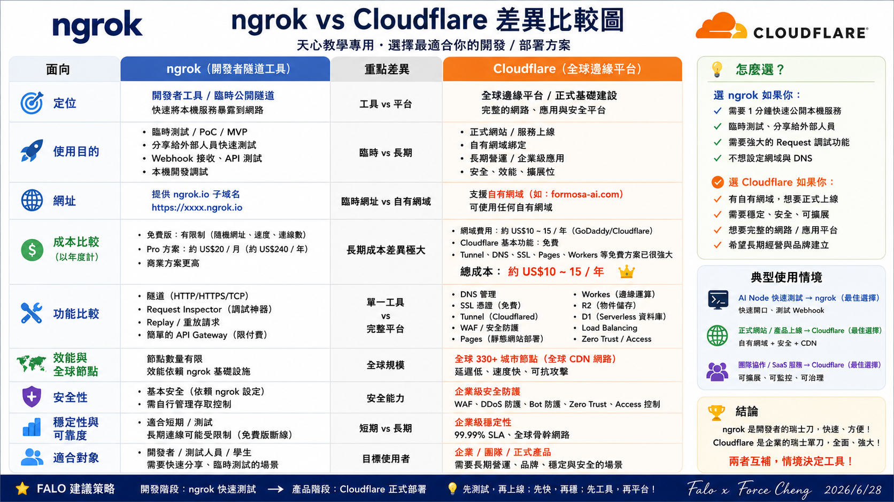

# 💼 7. 商業型整合專案

本區塊收錄具備高度商業應用價值與軟體工程規格的 AI 整合專案。相較於前述針對特定場景的基礎 ETL 實作案例，商業型整合專案更著重於解決企業實際落地時的複雜架構痛點（如多模型性能對比、地端與雲端網絡安全穿透、Serverless 雲端邊緣計算部署等），協助同仁以架構師的視角規劃具備長期維運與商業彈性的解決方案。

### 商業型整合專案 A：FALO NotebookLM Runtime Lab ─ 企業級知識庫整合運行網關
* **專案精神**：針對企業內部部署知識管理（KM）與自動化同步設計的網關（Gateway）。本案例由於涉及地端文件同步與自動化指令碼，線上展示僅提供「高階架構示意圖與原型卡片」，完整功能需結合本機開發環境與 **ngrok 安全隧道技術** 穿透進行實時操作與展示。
* **技術對比與特點**：
  * **雙版本門戶網關**：提供雙版本門戶入口，支援自動化文件同步腳本，免去手動上傳 NotebookLM 來源庫的限制；透過 ngrok 將地端自動化服務安全映射至公網。
  * **地端與 ngrok 隧道穿透**：利用地端指令列工具（CLI）與 ngrok 隧道，實現「非同步文件監聽 ➔ 自動同步上傳 ➔ 團隊共用導覽」之地端與雲端橋接技術驗證。
* **研究報告入口**：
  * [🌐 開啟 FALO NotebookLM Runtime Lab 門戶入口 (僅提供示意圖)](https://falo-taiwan.github.io/ai-notebooklm/) *(將於新分頁中開啟)*

### 商業型整合專案 B：LINE 資訊過載助手 ─ 深度研究彙總報告
* **專案精神**：解決 LINE 群組對話資訊過載痛點，透過極致 Prompt 工程與多模型並行測試，將碎片化對話自動提煉為高品質的結構化彙總與待辦清單。
* **技術對比與特點**：
  * **六大模型實測**：基於同一套基準 Prompt，深度對比 Google DeepThink（慢思考推理）、Google DeepResearch（長篇研究）、Claude（繁體中文美感）、Grok（即時社交熱點）、Kimi（超長文本細節）與 Perplexity（智慧搜尋背景）在對話摘要上的效能表現。
  * **ETL 資料管線**：探討非結構化聊天紀錄（TXT/CSV）的降噪、清洗、分段切片與級聯彙總設計，並提供多模型性能與 Token 成本評估，協助架構師規劃最優落地路徑。
* **研究報告入口**：
  * [🌐 開啟 LINE 資訊過載助手 ─ 深度研究彙總報告](https://falo-taiwan.github.io/ai-line-help/) *(將於新分頁中開啟)*

### 商業型整合專案 C：FALO Web Share API ─ 雲端 Workers 拍照快易部署與 QRCode 門戶
* **專案精神**：針對 AI 與雲端新手設計的超輕量 Web Share API 應用服務。本案例運用 **Cloudflare Workers** 進行 Serverless 邊緣計算部署，免去繁瑣的地端伺服器環境設定。協助 AI 新手小白簡單地使用 AI 服務，使用者只需透過手機拍照，即可將照片或檔案一鍵快速部署至雲端，並實時生成專屬的下載分享 QRCode，打通「實體捕捉 ➔ 邊緣負載 ➔ 雲端共享」的極簡化工作流。
* **技術對比與特點**：
  * **Cloudflare Workers 邊緣部署**：利用 Cloudflare Workers 的極速分佈式邊緣網絡架構，實現微毫秒級的請求響應與零維護伺服器成本。
  * **拍立即存與 QRCode 閘道**：串接 Web Share API 與雲端暫存機制，實時生成高精度的 QRCode，方便同仁在不同裝置（如手機、平板與電腦）間無縫流通圖片與資料資產。
* **研究報告入口**：
  * [🌐 開啟 FALO Web Share API 雲端 Workers 部署平台](https://falo-web-share-api.force-chinese.workers.dev/) *(將於新分頁中開啟)*

### 商業型整合專案 D：FALO 萬佛朝宗 ─ 企業級多通道重要工作資訊流與 AI Agent 知識核心架構
* **專案精神**：為解決企業內部多種溝通管道（Email、LINE、Telegram）資訊碎片化與難以沉澱的問題，本架構提出「萬佛朝宗」的終極解決方案。透過標準化的 ETL 資料管線將多元輸入進行擷取、清洗與 OCR 解析，匯聚至統一的 AI 知識庫（KM Core）進行向量化與關聯記憶。以此核心支撐各類 AI Agent（智慧問答、任務執行、內容生成、決策支援等），最後透過多通道（如自動信件、LINE 回覆、戰情看板、API/Webhook 等）進行反饋，建立企業智慧運作的完整資訊閉環。
* **技術對比與特點**：
  * **多元輸入與輸出管道整合**：整合 Email、LINE 官方帳號、Telegram 機器人等工作管道，並具備高度可延伸性（支援 Web 表單、WhatsApp、Slack、Teams），同時將產出反饋回多元終端。
  * **標準化 ETL 處理與知識核心**：採用標準的六大處理階段（擷取、清洗、解析、語意理解、向量化、載入），將無序的原始工作資訊轉化為統一知識庫（包含文件、對話、結構化數據、向量、知識圖譜、時間軸、安全權限控制等），支撐智慧問答與決策代理。
  * **跨層能力與合規支撐**：具備端到端加密、監控日誌、多模型管理、工作流自動化、合規稽核等平台級支撐能力，提供企業安全防護生命線。
* **系統架構圖**：
  
  
  
  

### 商業型整合專案 E：FALO Email 驅動雙軌 AI 翻譯與智能摘要服務
* **專案精神**：為降低同仁學習新 AI 工具的門檻，本案例採用企業最熟悉的「Email」作為交互媒介。使用者只需寄送一封郵件，即可自動驅動後台 AI 智慧引擎（進行翻譯、摘要、文件辨識、數據分析或行事曆管理等處理），並在數秒內收到 AI 的結構化回覆。特別針對外文信件設計「雙軌處理模式」，透過寄送至不同收件地址，自動分流為「Reading Mode 全文翻譯（忠實對照、適合工程/法務/執行者）」或「Executive Mode 智能摘要（提煉三大重點與行動項目、適合主管/決策者）」，實現「一封信件、兩種模式、無限可能」之無門檻 AI 落地應用。
* **技術對比與特點**：
  * **Email 2.0 AI Event Gateway 技術架構**：引進 Cloudflare Email Routing 免費路由別名，免去購買額外企業信箱的成本。透過 Edge Workers 作為前端處理，將不同的 Email 地址映射為專屬的「AI Function」接口（例如 `ocr@company.com`、`meeting@company.com`、`audit@company.com`、`invoice@company.com` 等），讓寄信自動觸發後台 AI 自動化工作流（Workflow），將 AI 默默運作於無形。
  * **零門檻 Email 驅動介面**：使用者無需登入任何新系統或學習 Prompt，沿用熟悉的郵件習慣即可啟動後台複雜的 AI 數據管線（含清洗、分類、摘要與回信）。
  * **雙軌自動分流與客製化處理**：系統根據收件地址（如 `Transfer1` 與 `Transfer2`）自動路由：
    * **Reading Mode (全文翻譯模式)**：自動提取外文信件原文，進行精準的段落比對翻譯，輸出雙語對照之結構化信件。
    * **Executive Mode (智能摘要模式)**：自動提取核心要點（Key Points）、待辦行動項目（Action Items）、重要時程（Timeline）及原信附件，為決策者快速降噪提煉。
  * **安全與經濟性兼顧**：信件內容自動去敏感化並進行 Token 快取節費，確保企業機密與成本效益。
* **服務架構與運行模式圖**：
  
  
  
  
  
  

### 商業型整合專案 F：資安與 AI 雙贏的下一代企業級架構 ─ Cloudflare 邊緣平台與合規通道設計
* **專案精神**：企業在導入 AI 服務時，常面臨「AI 的創新效率（希望快速測試、無障礙調用）」與「資安的風規控管（拒絕隨意架設 Tunnel、要求內網解密與全面審計）」之間的拉鋸衝突。本專案由「資安高手 Harrison」與「AI 高手 Force」共同研討，提出「合規通道，可控創新」的雙贏架構。透過 Cloudflare Edge Platform 作為全球邊緣節點，使用者端完全不需要安裝任何 Tunnel Client，全線透過合法的 HTTPS (443) 埠進行加密與混淆傳輸。此外，架構中對比了「ngrok（開發測試期隨手工具）」與「Cloudflare（正式上線期平台基礎建設）」的關鍵定位差異，協助企業架構師規劃兼顧「零信任安全治理（Access Policy / Zero Trust / 日誌審計）」與「敏捷創新」的 AI 落地基礎設施。
* **技術對比與特點**：
  * **合規通道與零內網穿透風險**：不強行突破資安防火牆，而是採用合法的 HTTPS / SMTP 通道入口，結合 Cloudflare Access、WAF 及 DDoS 防護，滿足企業資安治理（DLP/CASB、UEBA、日誌審計）的最高標準。
  * **Cloudflare Edge 邊緣整合運算**：結合 Pages、Workers 執行無伺服器邏輯，並透過 KV、D1 與 R2 儲存核心狀態，實現極速響應與零地端伺服器負載。
  * **ngrok 與 Cloudflare 雙軌部署策略**：
    * **開發階段 (ngrok)**：適合 1 分鐘快速公開本地服務、PoC/MVP 快速驗證。
    * **產品階段 (Cloudflare)**：綁定自有網域、享受全球 CDN、企業級安全防護與 99.99% 高可用度。
* **技術架構與部署差異圖**：
  
  
  
  
  
  