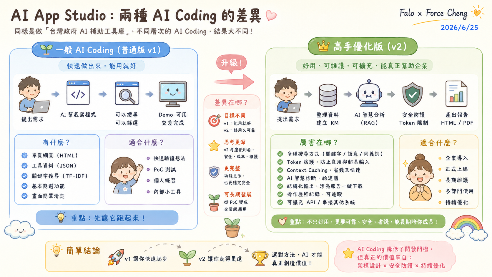

# AI KM 建置範例：台灣政府 AI 補助工具採集與 RAG 智慧檢索系統 (tw-ai-grant-intro.md)

本頁面為 Class 04 專屬設計之「AI 知識庫 (KM) 實戰建置範例」之技術導覽手冊。本專案並非直接套用外部的公務實用工具，而是**專為本課程重構與優化之企業級 PoC 示範**。

本專案使用政府多管道補助資訊碎片化的真實商業痛點作為載體，向同仁展示並傳遞在開發企業級 AI App 時最關鍵的**五個進階軟體工程觀念**。

---

## 🎯 專案重構定位與教學目的

學員應透過本專案跳脫「聊天機器人 (Chatbot) 即 AI 應用」的狹隘認知，深刻理解如何將**逆向資料採集、輕量前端 TF-IDF、Token payload 防護、以及 Context Caching（上下文快取）減費技術**融入正式的軟體開發管線中，打造符合天心 ERP 下一代 AI 生態圈架構的產品。

### 📊 AI KM RAG 系統整體架構圖

### 📈 AI KM RAG 系統數據管線與流程圖

---

## 💡 專案蘊含的五大核心軟體工程觀念

### 1. 工程務實主義 (Engineering Pragmatism) ─ 擺脫向量資料庫的迷思
*   **教學觀念**：對於 200~300 筆這種中小規模的企業內部專屬知識集，**純前端字元級 TF-IDF 檢索引擎（如 MiniSearch）是更務實、成本為零且秒級響應的解法**。應根據資料規模與場景選擇最適技術，而非盲目堆疊昂貴且複雜的雲端向量資料庫（Vector DB）基礎設施。

### 2. 物理與安全防禦 (Input Sanitization & Payload Defense) ─ AI 安全意識
*   **教學觀念**：在企業生產環境中，必須建立 **API Gatekeeper（閘道防護）** 的防禦意識。本專案展示了前端如何在請求送往雲端大模型前，嚴格限制 Payload 上限為 4,096 tokens。此物理邊界防禦不僅徹底杜絕超長文本导致的 API 刷爆財務風險，還有效攔截了惡意提示詞注入（Prompt Injection）。

### 3. 企業落地經濟學 (AI Economics) ─ 以 Context Caching 實現可控成本
*   **教學觀念**：當每次 RAG 對話都需要將整份知識庫丟給 LLM 時，Token 費用將成線性暴漲，企業難以承受。本專案引入 **Gemini API 的 Context Caching（上下文快取）** 技術。當整份工具庫被快取在雲端時，後續的多次對話診斷只需支付極低的快取讀取費用（降低 90% 成本），是企業 AI 應用規模落地的關鍵。

### 4. 從「對話」到「結構化價值交付」 (Structured Value Delivery)
*   **教學觀念**：企業需要的不是陪使用者聊天的 Chatbot，而是「能直接交付的商務文件」。本專案展示了如何將 AI 的多維度診斷結論，在前端直接渲染成排版精美、無廣告干擾的 Notion 風格 HTML 轉型建議書，一鍵即可列印或存為 PDF，實現「對話即交付」的高商務價值。

### 5. 零運維極致部署 (Zero-Runtime Cost & Serverless)
*   **教學觀念**：本專案重構成 **100% 自包含的單頁應用 (Single Page App)**，將 224 筆政府補助案黃金資料庫與檢索引擎、UI 邏輯完全封裝於單一 HTML 檔案中。無任何 CORS 跨域限制，可完全離線運行或透過本地 `file://` 直接開啟，展示了如何設計「零伺服器成本、零維運死角」的極致高可用 AI App。

---

## 🚀 實戰系統體驗與教材入口

本專案提供兩個不同重構階段的系統版本，以及一份完整的網頁逆向與前端 RAG 設計技術講義：

1.  **v2.10 進階版 (RAG 降噪與 Token 防禦控制台)**：[tw-ai-grant-v2.html](tw-ai-grant-v2.html) - 整合 Gemini 1.5 Flash 進行語意診斷，內置 Token 防禦機制、Context Caching 優化與 Notion 風格建议書產出。
2.  **v1.01 首發版 (雙層智慧過濾與地端秒檢)**：[tw-ai-grant-v1.html](tw-ai-grant-v1.html) - 展示純前端字元級 TF-IDF 全文檢索與多維度複合式篩選（適用對象、補助類別、地區）。
3.  **網頁逆向與本機 RAG 實戰講義**：[tw-ai-grant-lesson.html](tw-ai-grant-lesson.html) - 鄭穎臨老師專屬技術講義，詳解 Chrome DevTools 網路封包獲取 Sheet API 的逆向管線，以及 MiniSearch 與防禦模組的實作細節。
